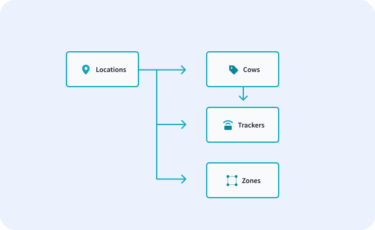

# Blueprints


Blueprints define the structure of our data and relationship between data entities in our solution. Let's say you had a tracker in your system. You would create a tracker blueprint, then add all of the attributes (data fields) that tracker needs. For example, you might add a position attribute, a temperature attribute, and a serial number attribute. 

Before creating your blueprint, let's review the two different types of blueprints our system supports. 

| Types | Definition |
|-------|---------------|
| Device | This blueprint will be used for IoT hardware. Examples might include a temperature gauge, a GPS tracker, or a more complex device that reports multiple types of information. |
| Group | This blueprint will be used for any type object that has a group of data fields. Examples include companies, locations, assets, vehicles, and more. |

<figure markdown>
{ width="700" }
  <figcaption>Creating a Blueprint</figcaption>
</figure>


## Blueprint Creation Order

When adding blueprints to a new project, it is helpful to add them in order of most specific to least specific – starting with the devices that provide the least context to other devices and ending with those that provide the most. This is because data in our system is roughly hierarchical – defined in terms of parents and children. By adding the children first, when we add the parent we are able to say that the parent is a parent of this type of thing that already exists in the system. 

As an example, we'll be looking at a cow tracking solution for farming company. The company has multiple farm locations. Each of these locations has multiple cows. Each cow will have one tracker. At each location, the cow fields are divided up into zones. From this information, we can infer the below hierarchy is the best for our solution. This is because a location is the best organizational method for our cows, trackers, and zones. In the diagram below, arrows are pointing from a parent to a child and signify that there is a relationship between the two boxes.

<figure markdown>
{ width="700" }
  <figcaption>Hierarchy Outline</figcaption>
</figure>

Based on this hierarchy, we need to make 4 blueprints. These blueprints represent the four different types of things we will have in our system. Based on best practices, we'd want to start with the tracker blueprint and finish with the location blueprint. 

* Tracker Blueprint
* Cow Blueprint
* Zone Blueprint
* Location Blueprint

The actual process of creating this blueprint takes a few seconds. But thinking through a tracker’s blueprint structure and setting it up correctly can help make your system easier to maintain, organize, and ultimately scale. 

Trackers send data in formats that we (typically) have no control over. They may include information our end users don’t care about, or format it in a way that is difficult to use. We need to balance the demands of preserving the data as sent (for auditing and diagnosis), and representing it in a way that makes sense to the users of our system. 

## Creating the Blueprint

Now, it's quite easy to create a blueprint in our system. First, you'll navigate to the blueprints section and click the `Create Blueprint` button in the top right corner of the screen. Because the tracker is IoT hardware, you'll select the blueprint type `Device`.

<figure markdown>
{ width="700" }
  <figcaption>Creating a Blueprint</figcaption>
</figure>

Once you've created the blueprint, there are a few information fields to fill in about the blueprint. 

| Field | Definition |
|-------|---------------|
| Name | Now, the easiest name to use would be tracker, but your system may have more than one type of tracker as it scales. Therefore, you might want to consider using the Tracker's marketing name (ex. Locator).  |
| Alias | The alias should be short, obvious, and camelCase. We’re going to set up API calls that query and route data using this alias. In this case, we'll use tracker |
| Description | Optional field to describe what your tracker in more depth. Here, we might put "Gen2 Cow Tracker" |

## Adding Attributes

Now that you've set up the blueprint, it's time to add your attributes. As a reminder, attributes are the data fields of a given blueprint.

The steps to create an attribute are: 

* Type in the attribute name in the path field input & hit return
* Select the type off the list (ex. string, temperature, geoposition)
* Customize any attribute configurations in the panel on the right

The value that we type into the add attribute box controls how the data is actually stored in our system (the key in a JSON object). We use camelcase as a matter of convention. The value you type here may not, however, be friendly to read on a UI. If you want to change the display name of the attribute, you can enter the display name in the configuration panel on the right. 

As an example, let's say your attribute path is *fishEaten*. A display name for this might be *Total Number of Fish Eaten*. 

### Planning the Attributes for IoT Devices

The most technical blueprint to set up will be the tracker blueprint, as it involves knowledge of the inbound messages the tracker sends and must be coordinated with your data ingestor. Below, we'll take some example inbound messages and point out how you could format your tracker blueprint based off of the given information.

Inbound Message Example

``` json
{
  "deviceId": "981472630769911",
  "time": 1619291293517,
  "payload": "+STA,981472630769911,28.39,1$"
}
```

Let's use the following example message to start off. The message is coming from the external world. It needs to be read by an ingestor that can translate into a device message that our system can understand. Our ingestor is going to choose how to parse out the information in this message, what bits of it to forward on, and how that data is named. We’re going to use our tracker blueprint to set out how we want the data to be structured once it gets into our system--to dictate how the ingestor should translate this message.

We can see that the inbound message to the ingestor gives us a deviceId, the time the message was sent, and the payload. In this case, the deviceId is an IMEI 
(International Mobile Equipment Identity), which is a commonly used ID format for IoT devices. The time the message was sent does not need to be included in the blueprint, and we'll trust our ingestor is storing that information in logs for future reference.

The real action is in the payload. It comes as a single piece of data (a string), but is packed with information. Our ingestor can parse this into a friendly message format. We just need to figure out what the format of each attribute should be. Below, we've outlined an example of the data you may receive and the attribute format (data : format).

Payload Breakdown

``` json
{
  temperature : number/degF,
  position : { lat, lon },
  inMotion: boolean,
  doorOpen : boolean,
  lights : boolean,
  imei : string,
  lastMsg : string,
  lastUpdated: timestamp,
  lastRecorded: timestamp,
  name: string
}
```

