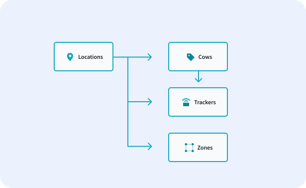

# Blueprint Relationships

Once you've created all of your blueprints, it's time to form your relationships. Let's take a look at our hierarchy again to form a plan. 

<figure markdown>
{ width="700" }
  <figcaption>Hierarchy Outline</figcaption>
</figure>

Our IoT stack supports 4 types of relationships. Note that the parent should always come first in the relationship. Imagine you have a location with 20 cows. The location is the parent in this hierarchy, meaning that this is a one-to-many relationship. 

!!! Tip "Relationships Should Always Be Created on the Parent Blueprint"
    Whenever you are making a new relationship, it must be done on the parent blueprint

| Types | Definition |
|-------|---------------|
| One-to-Many | In a one-to-many relationship, there is one parent (ex. Location) and many children (ex. Cows) |
| One-to-One | In a one-to-one relationship, there is one parent (ex. Cow) and one child (ex. Tracker) |
| Many-to-One | X |
| Many-to-Many | X |

The two most common relationship types are one-to-many and one-to-one. One-to-many relationships are commonly used for locations, companies, regions, etc and their children. One-to-one relationships are frequently used when you are pairing a single tracker to a single cow. 

Revisiting our farming example, let's discuss all of the different relationships. As a reminder, the farming company has multiple farm locations. Each of these locations has multiple cows. Each cow will have one tracker. At each location, the cow fields are divided up into zones. From this information, we can infer the below hierarchy is the best for our solution. This is because a location is the best organizational method for our cows, trackers, and zones. In the diagram below, arrows are pointing from a parent to a child and signify that there is a relationship between the two boxes.

To start, we'll take a look at the location blueprint and the relationships it should have. In a given location, you have multiple cows, trackers, and zones. These cows, trackers, and zones are only related to the given location. This means the relationship you want to use is a one-to-many relationship for each of the location's children (outlined below).

Location Relationships

* Locations have a one-to-many relationship with cows
* Locations have a one-to-many relationship with trackers
* Locations have a one-to-many relationship zones

We have one other relationship in this case, which is a one-to-one relationship between the cow & tracker. In this case, the cow is the parent because we'll want to set up something called data forwarding. 

Cow Relationship

* Cows have a one-to-one relationship with trackers

!!! Tip "Data Forwarding"
    When data forwarding is enabled, any data that the child device reports to our system will be forwarded to the parent device and stored on both the child and parent devices. This is useful in some circumstances like position tracking, where you want to store the data the tracker reported about it's location in the cow's history.

To create a relationship, you'll enter the name of the child blueprint in the path input field (singular or plural depending on if it's a one-to-one or one-to-many relationship respectively). When you select the type of attribute, you will choose relationship. Then you will be prompted to select the blueprint and relationship type. 

<== INSERT VIDEO HERE ==>

