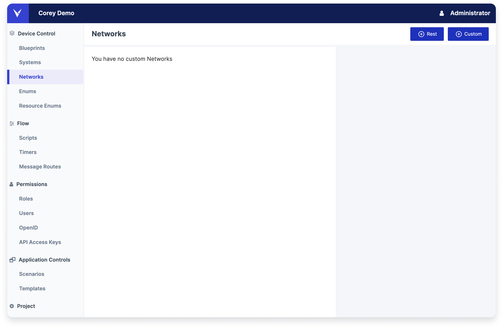
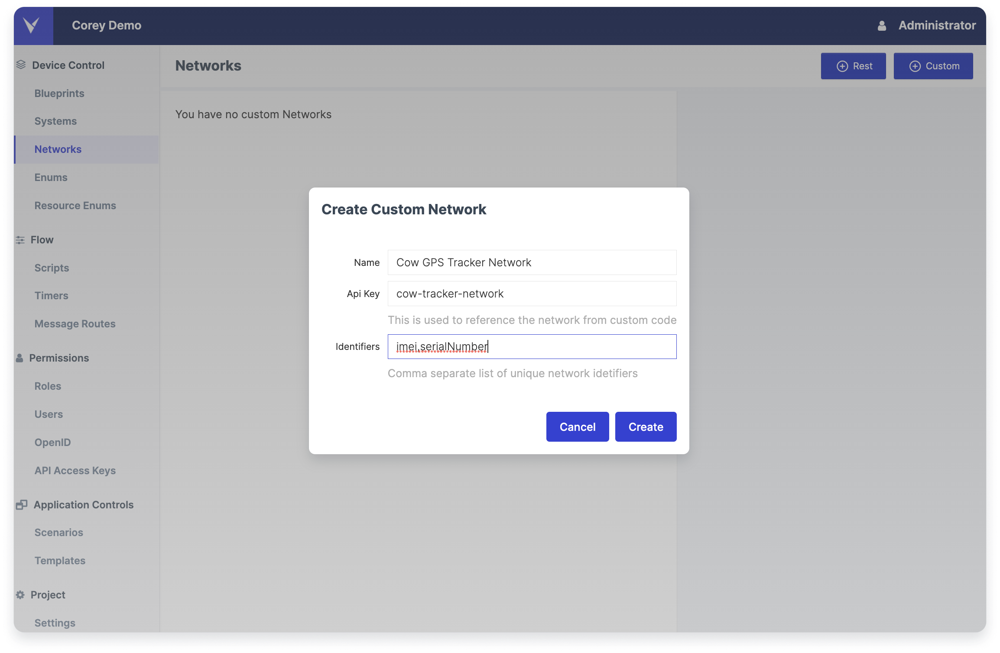

# Networks

A Network represents a source of device data. When a device needs to be contacted, the Network is used as the target. In particular, messages are published to the <networkId>-outbound topic. The ingestion service setup to manage that network's data can listen on this topic and then communicate appropriately to the source server. The Network ID is also part external identity of a Device.

Inside the Leverege Stack, devices (and many other elements of a project) are assigned a Base62 UUID. Base62 IDs consist of the capital letters A-Z, the lower case letters a-z, and the numbers 0–9. It is a binary-to-text encoding schemes that represent binary data in an ASCII string format. An example of a UUID is **1pTW01YR4mUAEbcHhbXHk8**. 

But these IDs are not how devices refer to themselves when sending a message, or how users refer to a device when they need to interact with it. Our example tracker from the cow solution sends an IMEI as its identifier when it reports. A farm hand might pair a tracker to a cow by scanning a QR code or typing an ID from a label printed on the tracker.  For this project, let’s assume the cow trackers have a QR code which encodes the serial number of the tracker.

Networks let us define how our internal devices will be mapped onto the the source, and set up messaging topics that allow communication with the device using these external names. 

## Creating a Network

<figure markdown>
{ width="700" }
  <figcaption>Creating a Network</figcaption>
</figure>

In your Architect project, click the Networks tab on the left side, and click the Add Custom button in the top right corner. The network creation form asks for three fields: a name, an api key (what we’ll call a networkId for reasons that will be come clear in a moment), and list of network identifiers (what we’ll call aliasKeys).

| Label | Value|  Definition |
|-------|------|---------------|
| Name | Display Name |  This is the display name of your network. |
| Device ID | `deviceId` |  This is the identifier of the given device ID. In our example of the cow tracker, the tracker's identifier is a serial number. |
| Identifiers | `aliasKey` |  This describes what type of identifier the given device ID is. It refers to a identifier type that we will enter into our network definition. |
| API Key | `networkId` | This is used as the networkID and tells us which network, from the list of the networks on the given API server, the API should look to find this device. |

To understand what work these options are doing, let’s take a look at our message docs for inbound messages. Inbound messages include a networkId, an aliasKey, and a deviceId. Note the example below:

``` json
 /**
 ...
 * @param {string} data.networkId The networkId of the source
 * @param {string} data.deviceId A string representing the external name of the device. This could be a serial number, MAC address, VIN, etc.
 * @param {string} data.aliasKey The name of the key that forms the mapping between the external device’s id and the internal device. This is stored in the internal device’s aliases list, and tends to be unique per network.
 ...
 */
```

API Server will, in essence, look at the given network for a device with an aliasKey value equal to the deviceId, and route the message to that device. 

When creating the network, we are defining the `networkId` and the `aliasKeys` on that network. The actual `deviceId` gets created at the device level.

## Choosing Good Network Values

Back to our Architect UI, where we are creating the network, we need to choose the name, API Key ('networkId'), and Identifiers ('aliasKeys'). 

The name is simply a human readable display name for the network, so that we can pick it out on our list of networks. We are creating the network for our cow trackers, so let's call it Cow GPS Tracker Network. Note that you should not include your environment in your network name (for example, Dev Tracker Network is a bad name). 

The networkId (entered in the ‘Api Key’ field) must be unique across all projects in your Architect instance. It should be short, and describe the source / interface. For our example, we'll use  ‘cow-tracker-network’. By convention, networkIds are skewer cased.

The aliasKeys are the types of external identifiers. The devices provide us with IMEIs when they send messages, and the users will use the serial number. It’s a good practice to be descriptive and specific with these names (and not just default to ‘deviceId’, for example). So lets set that field to ‘imei,serialNumber’.

<figure markdown>
{ width="700" }
  <figcaption>Creating a Network</figcaption>
</figure>


To tie this together, this tells us that a parsed inbound Cow Tracker device message from our ingestor might look something like this:

``` json

{
  type : 'inboundDataEventMsg',
  time : 1619388341985,
  networkId : 'cow-tracker-network',
  aliasKey : 'imei',
  deviceId : '981472630769911',
  data : [
   { path : 'temperature', value : 30.20 }
  ],
}

```


