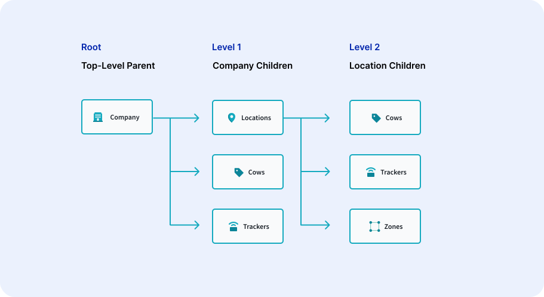

# Permissions

## Terminology

| Field | Definition |
|-------|---------------|
| System | Systems are buckets of devices that can be used to logically separate sets of devices from each other. Systems use only the common CRUDL permissions. |
| Device | Devices are digital shadows of physical objects. They can represent hardware devices like trackers, physical assets like cows, or organizational buckets like companies. |
| Blueprint | Blueprints define the structure of our devices and relationship between device entities in our solution. Some permissions are generated when Blueprints or relationship Attributes are made.  |

## Common Permissions

Some permissions can be seen used against nearly every type of object in the platform. These are the CRUDL permissions. CRUDL is an acronym that stands for Create, Read, Update, Delete, List.

* Create - the permission to create an object
* Read - given some object’s id, the ability to read its data
* Update - given some object’s id, the ability to update its data
* Delete - given some object’s id, the ability to delete it
* List - the ability to get a list of all objects without having to know their ids

## Permission Categories

When adding permissions to roles, you'll see that there are 3 different categories of permissions.

| Category | Definition |
|-------|---------------|
| Custom | Custom refers to custom permissions built for custom actions or access in your project  |
| Project | Project permissions are permissions that are autogenerated for your blueprints, relationships, etc. They are project-specific and relate to your data architecture. |
| Imagine | Imagine permissions are permissions relating to modules and features that are the same across projects. An example of this is user management permissions.  |

## System Permissions 

Systems are buckets of devices that can be used to logically separate sets of devices from each other. Systems use only the common CRUDL permissions.

## Device

Devices are digital shadows of physical objects. They can represent hardware devices like trackers, physical assets like cows, or organizational buckets like companies. Devices use the common CRUDL permissions, but also have the following custom permissions:

* readData - Read not only a device’s header information (like a name), but also its data, which might include things like sensor readings, addresses, or contact information.
* readHistory - View the changes to a device’s data over time
* readEvents - View the relevant events that have occurred to a device over time. Might include things like threshold violations or alerts.
* updateEvents - Update or create device events
* sendMessage - Send a device a message. This may only be relevant if a device is physically capable of receiving messages, like in the instance of configuring a tracker or other piece of hardware.
* runSimulation - Simulate a device
* readByNetworkAlias - Get devices by their network ids
* deleteRelationship - Delete a device's relationship. For instance, removing a cow from a barn stall, or unpairing a car and a tracker. Deleting a relationship will not delete the device.
* createRelationship - Create a device’s relationships. For instance, pairing a car and tracker. Creating a relationship does not create a device.
* updateData - Update a device’s data. This generates historical data points, and will be reflected to anyone with a readData permission. An example of updating a device’s data would be setting a Farm’s address.
* updateAnyData - A more powerful version of updateData. Users with updateData are restricted to updating fields as validated by the device’s Blueprint. Users with updateAnyData are not subject to that restriction. As an example, a user with updateData likely couldn’t change the temperature reported by a sensor, but a user with updateAnyData could. This permission is usually only for administrators.

## Blueprints & Relationships

Some permissions are generated when Blueprints or relationship Attributes are made. They tend to follow a similar form as the Device permissions. The main difference is that Blueprint or Attribute level permissions only allow a user to perform actions on Devices of a given type, or at certain paths in the hierarchy as defined by the Attributes. Their permissions are as follows:

### Blueprints:

For blueprint permissions, these will appear in the blueprint section. For our farm example, a permission the farm administrator might need is `Create Locations`. This would allow the farm manager to create new locations. 

* Create Blueprint - create Devices of a given blueprint type
* Read Blueprint - read Devices of a type (if you know the id)
* Update Blueprint - update Devices of a given blueprint type
* Delete Blueprint -  delete Devices of a type
* List Blueprint - list Devices of a type
* Read Blueprint History - read the history of any Devices of a given type
* Read Blueprint Events - read the events of any Devices of a given type
* Update Blueprint Events - update the events of any Devices of a given type
* Send Blueprint Messages - send messages to any Devices of a given type
* Delete Blueprint Relationships - delete any relationships that go to Devices of a given type
* Create Blueprint Relationships - delete any relationships that go to Devices of a given type
* Update Blueprint Data - update the data of any Devices of a given type
* Update Any Blueprint Data -update any data (unvalidated) of any Devices of a given type

### Relationship Attributes

To better understand relationship attribute permissions, we will use our farm example. Imagine you want to permission a farmhand to take actions against a cow, but ONLY in the location they have access to. To do this, you would give the farm hand role permissions like "Create a Cow in a Location". If a user has the farmhand role in the Rockville location, they will be able to create cows inside that location. If they do not have a role at the Atlanta location, they will not be able to access that location or create cows in that location. To better understand the permissions below, we will include the example blueprints Cow & Location in parenthesis, while Blueprint X & Blueprint Y represent two generic blueprints  that have a relationship with one another.

* Create Blueprint X (Cows) in Blueprint Y (Location): Create Devices of a given Blueprint at a given place in the hierarchy
* Read Blueprint X (Cow) from a Blueprint Y (Location): Read Devices of a given Blueprint at a given place in the hierarchy (must know the id)
* Update Blueprint X (Cow) in a Blueprint Y (Location): Update Devices of a given Blueprint at a given place in the hierarchy
* Delete Blueprint X (Cow) from a Blueprint Y (Location): Delete Devices of a given Blueprint at a given place in the hierarchy
* List Blueprint X (Cow) in a Blueprint Y (Location): List Devices of a given Blueprint at a given place in the hierarchy
* Read Blueprint X (Cow) History in a Blueprint Y (Location): Read the history of Devices of a given Blueprint at a given place in the hierarchy
* Read Blueprint X (Cow) Events in a Blueprint Y (Location): Read the events of Devices of a given Blueprint at a given place in the hierarchy
* Update Blueprint X (Cow) Events in a Blueprint Y (Location): Update the events of Devices of a given Blueprint at a given place in the hierarchy
* Send Blueprint X (Cow) Messages in a Blueprint Y (Location): Send messages to Devices of a given Blueprint at a given place in the hierarchy
* Remove Blueprint X (Cow) from a Blueprint Y (Location): Delete relationships to Devices of a given Blueprint at a given place in the hierarchy
* Add Blueprint X (Cow) to a Blueprint Y (Location): Create Relationships to Devices of a given Blueprint at a given place in the hierarchy
* Update Blueprint X (Cow) data in a Blueprint Y (Location): Update the data of Devices of a given Blueprint at a given place in the hierarchy
* Update Any Blueprint X (Cow) Data in a Blueprint Y (Location): Update any data (unvalidated) of Devices of a given Blueprint at a given place in the hierarchy

### Example

In our farming example, let's imagine we have the following hierarchy.

<figure markdown>
{ width="700" }
  <figcaption>Example of Farm Hierarchy</figcaption>
</figure>

Let's say you want to give your farmhand role the ability to create a cow, but only in a location. Your permission for this would be:

* Create a cow in a location

This permission allows the user to create a cow when they are at the  location level  cows  page. This user would not be able to create a cow on the cows page at a company. 

Now, you want your farm manager role to be able to create a cow in a location and in a company. They would have two permissions on their role:

* Create a cow in a location
* Create a cow in a company

Finally, let's say instead of letting the farm manager role create cows in a location or in a company, you want them to be able to create a cow anywhere in the system. For this, you would use the  following blueprint-level permission

* Can create a cow

## API Access

ApiAccess objects represent sets of tokens/keys that allow third party services to connect to the Leverege Platform (usually as project level admins) using OAuth2. ApiAccesses use only the common CRUDL permissions.

## User Management

Users are the users of a give IoT project. Users use the common CRUDL permissions, but also have the following custom permission.

* assignRoles - allows a user to assign roles to other users. Unless they’re admin, users can only assign roles they already have.

For the common CRUDL permissions, when applied to user management, they look like the following. 

#### Users CRUDL Permissions

* Create 
* Delete
* List
* Read 
* Update

## Network

Networks represent a collection of mappings from external ids to internal Leverege ids. Networks ensure that only one device at a given time can have a given external mapping. For example, if you are sending tracker data into the Leverege Stack, that data will need some form of identifier to say what device it is from. Many times that id is chosen by the manufacturer, say a serial number or SKU. A network will map that serial number or SKU to a device’s unique id in the Leverege Stack, and ensure that mapping is one-to-one. Networks use only the common CRUDL permissions.

!!! Tip "Common Permission Needed for Pairing"
   readByNetworkAlias is a common permission that must be added to a role if that role is responsible for pairing one device to another and the network ID is used in the pairing form

## Configuration

By default, any user can perform UI configuration for themselves. To learn move about what UI configuration entails, please visit our section in the documentation on configuration. Note that an engineer has the ability to hide configuration on a per-role basis in the config file on the UI. 

!!! Tip "System-Level Access Required"
    For a user to configure UIs for other users, they must have a role at the system-level that has the resource permissions

For a user to be able to configure a UI for a given role or for all roles, they will need specific permissions against resources, which refer to the UI resources used to show configurations per role. Resource permissions are common CRUDL permissions. 

#### Resource Permissions

* Create 
* Delete
* List
* Read 
* Update
