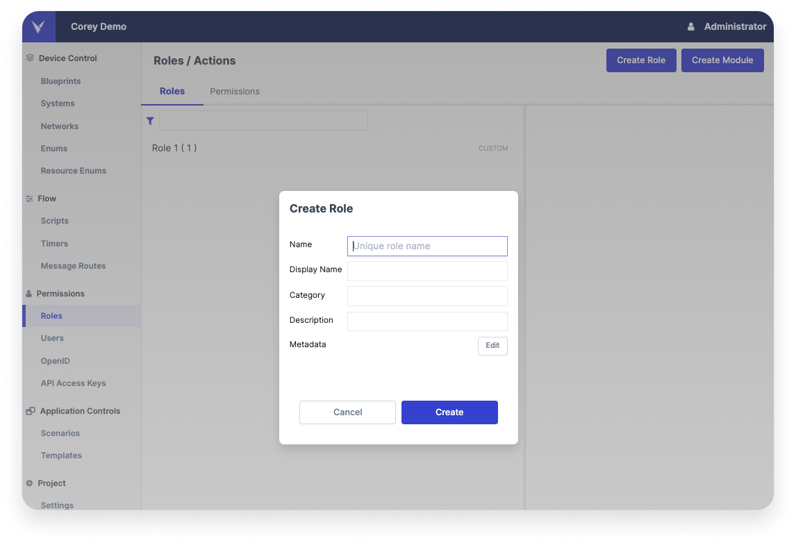
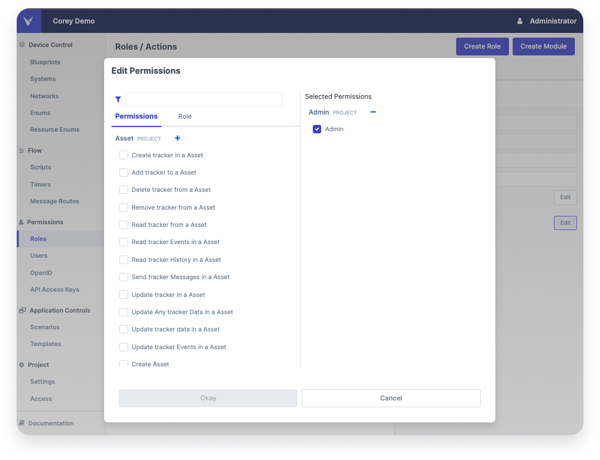

# Creating a Role

The Leverege Stack builds up a large number of pre-configured roles based on blueprints that a user might wish to employ in their system during the early start-up stages. Common roles include things like Device Viewer, Device Editor, and Device List Editor. Realistically, once you reach a phase in your development where you have end-users, custom roles are needed to fine-tune your solution to your use case.

Commonly, users create custom roles that match 1-to-1 with the personas of a customer or product. A persona is a set of responsibilities a certain type of user has to carry out one or more business processes. Examples of personas in an IoT application include Company Admin, Location Admin, Location Editor, and Location Viewer. In Architect, users would create roles corresponding to each of these roles.

To create a custom role, you'll head to Architect and select the Roles tab in the left sidebar of your project. There, you will be able to create custom roles for your project by selecting the Create Role button in the top right corner.

<figure markdown>
{ width="700" }
  <figcaption>Create Role Form</figcaption>
</figure>

## Terminology

| Field | Definition |
|-------|---------------|
| Name |The name is the path of the role. This must be named using camelCase. For example, Location Admin would be written locationAdmin |
| Display Name | This is the UI friendly version of the name. In the above example, you might write Location Admin |
| Category | This is an optional field where you can assign a role a category |
| Description | This is an optional field to help others understand what this role is for |
| Metadata | For a given role, you have a host of metadata options to help configure your UI. Review these in the <==UI Setup section==> |

## Assigning Permissions to a Custom Role

Once your role is created, you can assign permissions to the role. To do so, click the edit button next to the permissions section in the right hand panel. That will open the following modal. 

<figure markdown>
{ width="700" }
  <figcaption>Add Permissions Form</figcaption>
</figure>

