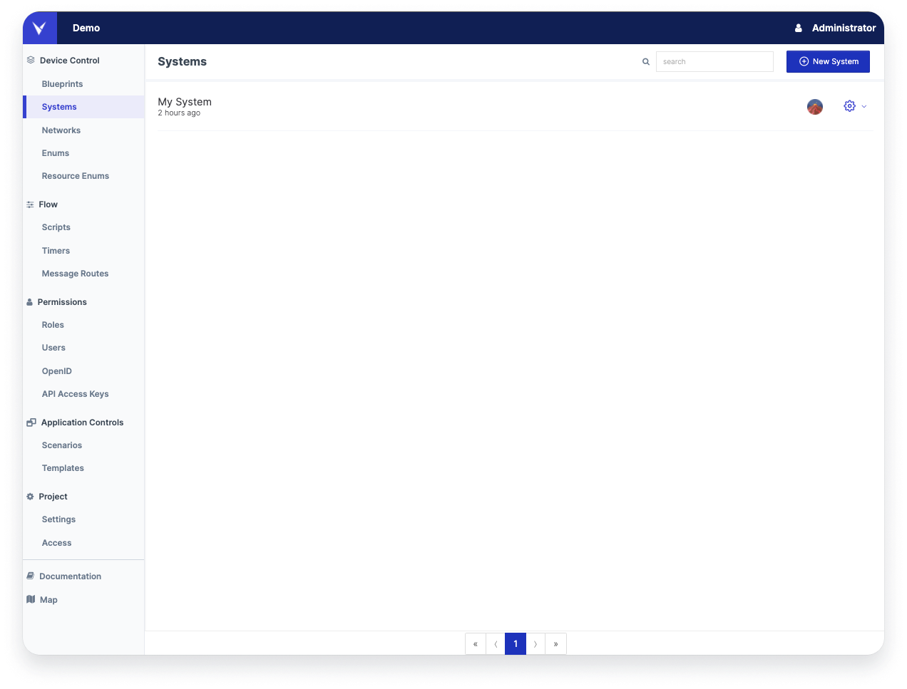
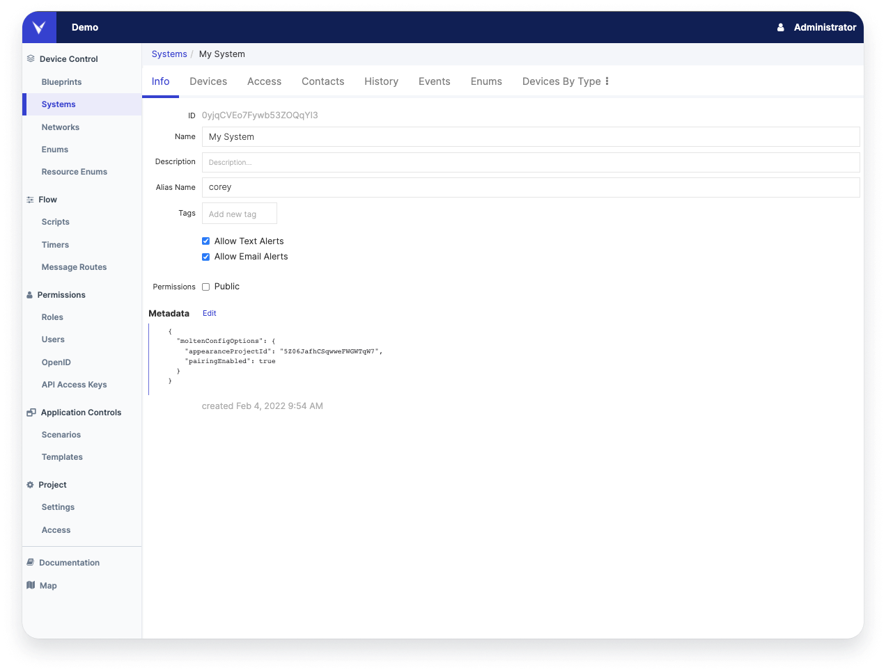

# Systems & Devices

A System holds a collection of Devices. Projects can have multiple systems. Systems are entirely separate from each other with separate databases.

Devices are the digital representations of the real world entities in our project: facilities, zones, trucks, and trackers for example. They are collected in a system in our Architect project. Systems are one of the places where we introduce permissioning and access control. Project Users can be given access rights to a System, allowing different users to access different collections of Devices.

Systems can be used to silo devices on a project. A good use case for this would be a hospital equipment tracking project where each hospital company has it's own system, ensuring complete data separation. Systems give a clean, simple division for separating devices that will never need to interact.

## Creating a System

<figure markdown>
{ width="700" }
  <figcaption>System Management</figcaption>
</figure>

To create a new System, go to the System tab on the left, and click Add New System in the top right corner. Once your system is created, you will want to update the display name and the alias. The alias is how custom API calls will refer to this collection of devices. Using an alias instead of the system ID (which is also an option) allows us to make minimal changes when deploying a production application off of a staging or development environment. 

<figure markdown>
{ width="700" }
  <figcaption>System Information</figcaption>
</figure>

 
