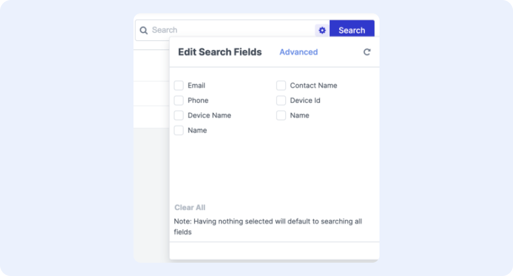
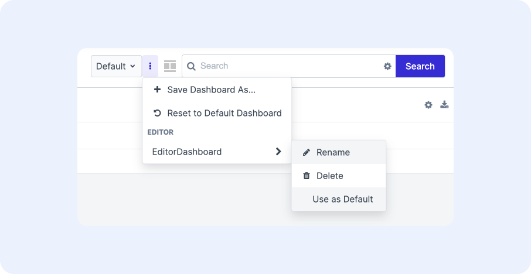

# Configuration and Dashboard Basics

The following sections describe how to interact with configuration panel, save configured components to a dashboard, and administer a dashboard to be seen by either all or select users of an application.

## Accessing a Configuration Panel

Each configurable component in the application is controlled by a configuration panel. All configuration panels share a similar layout and set of functions. Accessing the configuration panel differs by component, but most can be identified with the gear icon. Refer to the specific component’s documentation for instructions on how to exactly access its configuration panel. 

Configuration is only available for those users with the appropriate permission.

## Primary Configuration Area

The primary configuration area on a configuration page is typically a 2-panel card. For example, tables have a configuration area where the list of available fields are selectable on the left and the configurable values are displayed on the right. 

<figure markdown>
{ width="600" }
  <figcaption>Example configuration panel for table viewer component</figcaption>
</figure>

The primary configuration may vary slightly depending on the UI component. For example, in the search bar configuration, the configuration area is a list of the searchable fields with checkboxes.

<figure markdown>
{ width="500" }
  <figcaption>Example configuration panel for search bar component</figcaption>
</figure>

## Versions

A version is a saved configuration profile for an individual UI component. A user may use versions when experimenting with the configuration of a component before rolling it out to others. 

A version is specific to the user, in that no users can see another’s user versions. 

### Create A Version

To create a version, use the **Save To > Create Version** button in the upper right of the configuration panel. 

### Save A Version

Once created, users can save their current component’s configuration to the version by clicking **Save To > Versions** and selecting the version. Once saved, click **Apply** to apply the configuration to the component.

<figure markdown>
{ width="500" }
  <figcaption>Saving to configuration a version</figcaption>
</figure>

### Load A Version

To retrieve a previously saved version, click the **Load From** button in the upper left of the configuration panel and select the desired version. This will load that version’s configuration into the panel. Click **Apply** to the apply that version’s configuration to the component.

<figure markdown>
{ width="500" }
  <figcaption>Loading a configuration a version</figcaption>
</figure>

### Delete A Version

To delete a version, click the three dots icon next to **Save To  > Delete Versions**, and select the version to delete. Confirm the deletion in the prompt.

## Configuring a Page

The high-level steps to configuring a page are:

1. **Pick the role and page**: If the configured page is applicable to a specific role, assume the role using the role selector. Then, navigate to the page where the configuration should apply.

1. **Configure each component on the page**: Refer to the UI component documentation as necessary

1. **Save the configured state to a dashboard**: The dashboard can either be an existing or new dashboard. If new, specify where and to which users the dashboard can be shown as a selection option.

1. **Set the priority of the dashboards by setting defaults**: once the dashboard is saved, determine when it should be shown to a user in relative priority to other dashboards already configured for the page

### Pick the Role and Page

It’s common for an application to present data on the same page differently to users with different roles. For example, a field engineer may want to see the battery level and firmeware version of a device, while a customer service rep may want to see its last known location. 

1. If the configuration is applicable to a specific role, assume the role by selecting it from the role selector. Access the role selector by clicking the username in upper right of the page and selecting the role under **User Role**.

1. Navigate to the page to where the configuration should be applied. For example, if the configuration is intended for the Assets page, navigate to the Assets page.

1. If the configuration is meant to be applied to an existing dashboard, load the dashboard by selecting it from the dashboard selector at the top of the page.

<figure markdown>
{ width="500" }
  <figcaption>Dashboard selector</figcaption>
</figure>

### Configure Each Component on the Page

Use the layout controller to place the desired components on the page. Refer to the documentation for the layout controller for more details.

For each component, access the control panel and make the desired configuration changes. Click **Apply** in the configuration panel of that component once all the desired changes are performed. Refer to the document for the specific component for more details.

### Save the Configured State to a Dashboard

Once all configuration to all components have been completed, a user can save the entire state of the page to a dashboard.

1. To save the configured state to the current dashboard, click the check mark icon next to the dashboard selector.

1. To revert the changes back to its previously saved state, click the reverse circle icon.

<figure markdown>
{ width="300" }
  <figcaption>Save and revert dashboard changes</figcaption>
</figure>

!!! Note "Note: Default Dashboard"
    Note: The Default dashboard is a user’s personal dashboard configuration for exact page location. Saving the configuration to the dashboard titled “Default” will only apply the configuration as the default dashboard to the current user, for currently assumed role, and to exact path for which the configuration was performed. 

    For example, if a user A is on the Company > Assets page as Role A and saves a new configuration to the Default dashboard at that page, it will affect only the Default dashboard for User A while they are using Role A on the Company > Assets page. 

    It will not impact the Default dashboard for user B at Company > Assets using Role A, not impact Default dashboard for any users at Company > Assets using Role B, and not impact the Default dashboard of user A at other Asset paths (e.g. Location > Assets) using Role A.

1. To save the configured state to a new dashboard, click the three-dot icon next to the dashboard selector and click **Save Dashboard As…**

1. In the Save Dashboard As… popup, enter the name of the new dashboard

1. Select the availability of the dashboard from the **Available To** dropdown:

    1. **Role Level** - Any <role X> on this page: The option to select this dashboard will appear for any users of role X on this exact page path, with role X being the currently assumed role of the user doing the configuration. For example, only show this dashboard for users with Role A and on the Assets page at the Company > Assets path. This will create an option in the dropdown under the “Role” section of the dashboard selector.

    1. **Page Level** - Any user on this page: The option to select this dashboard will appear for any user of any role on this exact page path.  For example, show this dashboard for all users on the Assets page at the Company > Assets path. This will create an option in the dropdown under the “Page” section.

    1. **Blueprint Level** - Any user on the page showing this page's Blueprint type: The option to select this dashboard will appear for any user of any role on a page of the same Blueprint type as the one being configured. For example, show this dashboard for all users on all Asset pages, regardless of its specific path. This will create an option in the dropdown under the section named after the Blueprint type (e.g. Assets).
    
    1. **Personal Blueprint Level** - Me on any page showing this page's Blueprint type: The option to select this dashboard will appear for only the current user on any page of any role on a page of the same Blueprint type as the one being configured. This will create an option in the dropdown under the “Mine” section.

<figure markdown>
{ width="400" }
  <figcaption>Available To dashboard options</figcaption>
</figure>

!!! Question "Saving to Current User & Page Only"
    Looking for an option to save the configured page to the current user for the current role and current path? Save the dashboard to the Default dashboard by click the check mark next to the left of the dashboard selector.

### Set the Defaults Of The Page

The previous section on Saving the Dashboard produces a dashboard that is available for selection by a user on a give page. It does not yet specify whether it will load by default when a user visits that page.

In order to apply the dashboard to pages so that it loads for given users, page locations, and roles, set the dashboard defaults. 

1. Click the three dots icon next to the dashboard selector to load the list of editable dashboards
1. Depending on how many dashboards you have configured and their availability on the page, you will see dashboards separated into the following categories based on availability criteria:
    1. **Role** - Dashboards that are available to show on this page based on the user’s role
    1. **Page** - Dashboards that are available to show on this page based on the user’s page path in the application
    1. **[Name of Blueprint Type]** (e.g. Assets) - Dashboards that are available to show on this page based on the type of blueprint that page is showing
    1. **Mine** - Personal dashboards that are available to show on this page based on the type of blueprint that page is showing
1. To set a dashboard to show by default on the page when it meets the availability criteria, select the dashboard > **Use as Default**.
    1. Only one dashboard from each section can be set as default (e.g. only one Role-level dashboard can be set as default, one Page-level dashboard can be set as default, etc.) 
    1. In the event that multiple dashboards across each section is set as default, the application shows the default dashboard based on this ranking (from highest to lowest):
        1. Mine
        1. Role
        1. Page
        1. Blueprint
        1. Default

<figure markdown>
{ width="500" }
<figcaption>Setting a dashboard to be default on this page for users in the Editor role</figcaption>
</figure>

### Managing Dashboards
#### Renaming A Dashboard

To rename a dashboard, click the three dots icon next to the dashboard selector and select the **[dashboard name] > Rename**.

#### Delete a Dashboard

To delete a dashboard, click the three dots icon next to the dashboard selector and select the **dashboard name > Delete**. If the deleted dashboard was displayed on the page, the page will switch to showing the Default dashboard.

#### Reset Personal Default Dashboard Back to Stock

If the Default dashboard has been changed and a user wishes to reset it back to its original state (e.g. “factory defaults”), select the Default dashboard from the dashboard selector. Then click the three dots icon next to the dashboard selector > **Reset to Default Dashboard**.

## Configuration Best Practices

We’re working on making a list of best practices, stay tuned!