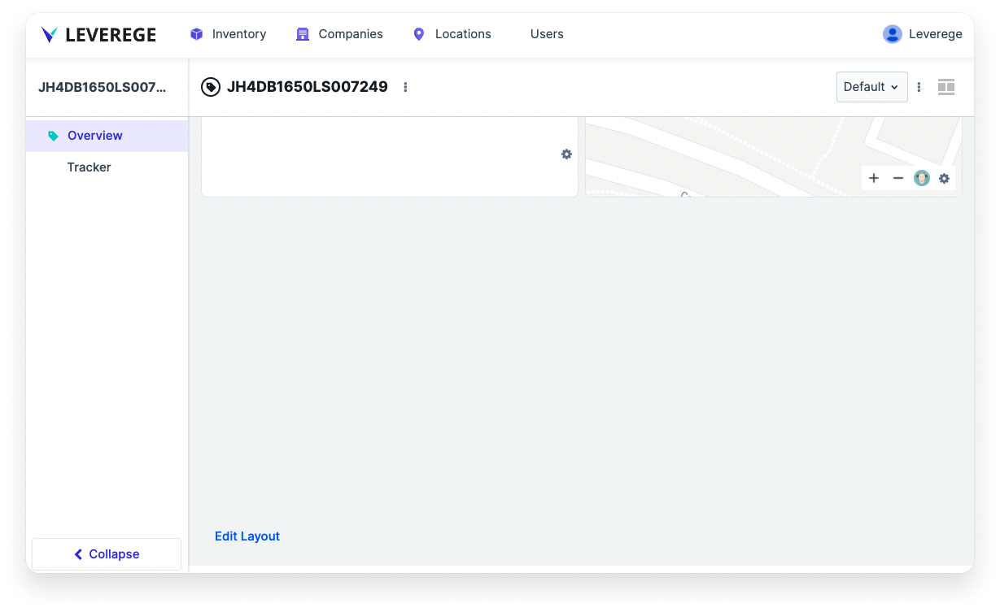
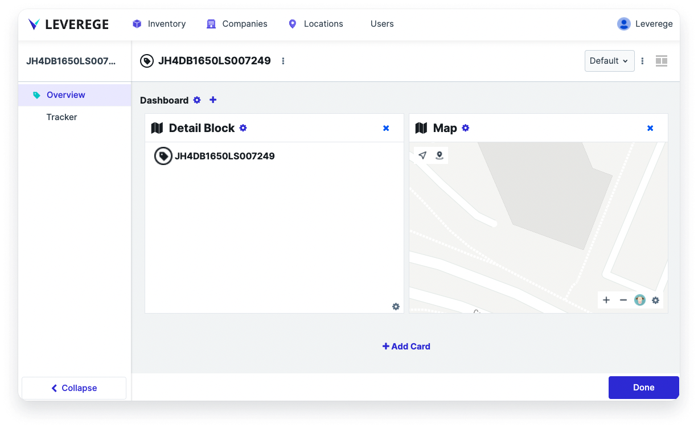

# Dashboard Viewer

The dashboard viewer is a component that displays details of assets, devices, or objects and its associated blueprints in a multi-card dashboard. Users access a dashboard by double-clicking into a row in a table of those objects.

## Accessing the Dashboard Configuration

To access the dashboard configuration, double click an entry in a table viewer or list viewer. Then scroll down to the bottom of the page and click **Edit Layout**. The dashboard will become editable by surfacing a series of buttons to add, remove, and update cards.

<figure markdown>
{ width="600" }
  <figcaption>Accessing the dashboard configuration edit mode</figcaption>
</figure>

<figure markdown>
{ width="600" }
  <figcaption>View of a dashboard in edit mode</figcaption>
</figure>

## Configuring the Dashboard Viewer

### Configuring the Dashboard Page Layout

While it is common for the dashboard to take up the entire page, users can display the dashboard viewer alongside one or more other UI components. For example, users configure the dashboard on the left and the map on the right.

Set the layout of the dashboard with other components by clicking the layout controller icon in the upper right of the page.

### Grid Options

A **grid** is a dashboard element designed to hold and organize other dashboard cards. Without grids, cards added 

To access grid options, click the gear icon next to the Dashboard title. Users can also access grid options for individual grids by clicking the gear icon next to the Grid title.

* **Columns**: To set the number of columns of cards on the dashboard, change the Columns field

* **Column Width**: To set the width of each column, change the Column With field. Widths can be specified in units such as px or fr.

* **Row Gap**: To set the gap size between rows of cards at the given grid level, change the Row Gap field

* **Column Gap**: To set the gap size between rows of cards at the given grid level, change the Column Gap field

### Card Options

To access card options, click the gear icon next to the Grid title. The dialog that appears will contain both the Card Options and Grid Options.

* **Title**: To set the title of the card, change the value in the **Title** field
* **Icon**: To set an icon on the grid title, specify the name of the icon in the field. To have no icon, use the value “no”
* **Show Title**: To show/hide the title, toggle the checkbox
* **Size**: To set the width and height of the card, change the **W** and **H** fields
* **Style**: To set the style of the card, select the style from the dropdown
    * **Grid**
    * **Section**: Adds a border radius only at the bottom edge of the card. The intended use is as the “bottom half” of a card, with a secondary card located above it to look like a single card. A common configuration of this card is to turn off the header and set the parent’s grid row gap to 0.
    * **Transparent**
    * **Secondary** - Adds a border radius only at the top edge of the card. The intended use is as the “top half” of a card, with a section card underneath to display more detailed data
    * **Tertiary** - Adds extra padding around the card to give the appearance of supporting information
* **Height**: To set the height of the card, change the value in the **Height** field

### Adding a Card Type

To add a card type, select the **+** sign next to the title of the grid. Available card types are **Grid**, **Data Card**, **History Card**, and **Map Card**.

[Screenshot of navigation to adding a card to a dashboard or grid within a dashboard]

### Configuring the Grid

Use a grid element to organize cards and create sections to display cards. Users can add one or more grids to the dashboard to hold a combination of data, history, and map cards. Users can also add grids within other grids for further organization.

!!! Tip "Grids for independent columns"
    One advantage to using grids is to make data cards in each column more independent. Even though a dashboard may have multiple columns and will automatically fill cards into those columns, having a dedicated grid in a column will allow the cards to fill down each column. Without grids, cards in adjacent columns will get set to the same card height.

    To take advantage of this ‘independent fill down’ behavior, make sure to set the Size of the grid to have a W = 1. By default the grid has a Size with W = 2.

For grid and card configuration options, refer to the sections on **Grid Options** and **Card Options**.

### Configuring the Data Card

A data card is used to display data on assets, devices, and related blueprints in a card format.

To access the data card configuration, click the gear icon in the bottom right of the card.

The data card configuration follows the same configuration as a **List Viewer**. Refer to the **List Viewer** configuration for details.

### Configuring the History Card

The history card shows the historical data on the selected asset/device on the dashboard. 

The history card behaves like a **Responsive History Table** with the card showing as a **History Table** view above a certain dimension threshold and as a **History List Viewer** below the threshold.

The history card configuration follows the same configuration as the **Responsive History Table**, so refer to the configuration for the **History Table Viewer** and a **History List Viewer** for details.

### Configuring the Map Card

The map card uses icons to show objects on the map in the dashboard view.

To access the map card configuration, click the gear icon in the bottom right of the card.

The map card configuration follows the same configuration as a **Map Viewer**. Refer to the **Map** configuration for details.

!!! Tip "Dashboard Configuration Best Practices"
    If using a map card on mobile, consider using a map layout component to take up an entire section (configured using a layout controller) instead of using a map card in the dashboard. Using a map card on the mobile view may generate more whitespace/margins on mobile than desired, which detracts from the total viewable area of the map.