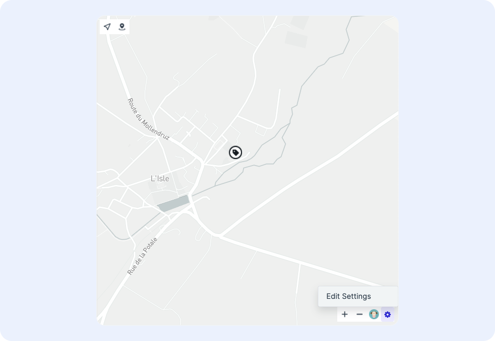
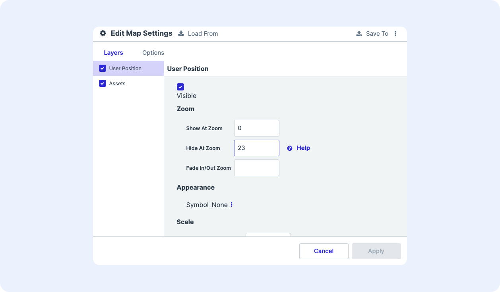
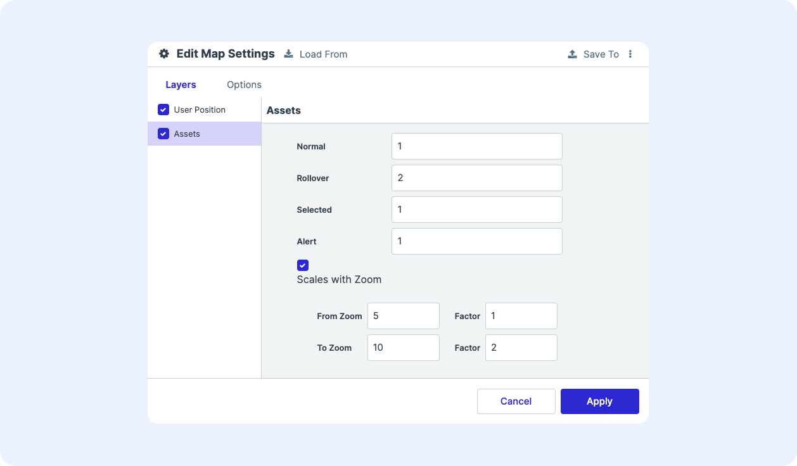
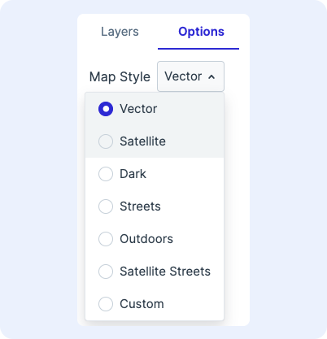

# Configuring the Map

## Accessing the Map Options

To access the map configuration options, click the gear icon at the bottom of the map component and select **Edit Settings**.

<figure markdown>
{ width="500" }
  <figcaption>Locating the map settings icon</figcaption>
</figure>

## Configuring Map Layers

Icons and geofences on maps are represented as layers. The layers menu lists the layers available for configuration. The list of layers are automatically generated based on position and geofence attribute types.

To update the ordering of which layers display over others, click and drag the name of the layer into the desired position.

<figure markdown>
{ width="700" }
  <figcaption>Map configuration panel</figcaption>
</figure>

## Configuration Options for Position Attributes

For position attributes (e.g. user position, asset positions, device positions), the following configuration options are available:

* **Visible**: To set the layer to be visible, check the box next to Visible. To hide the layer, uncheck the box.
* **Zoom**: 
    * To set the minimum zoom level by which the layer is visible, update the “Show At Zoom” field
    * To set the maximum zoom level by which the layer is visible, update the “Hide at Zoom” field
    * To set the zoom level by which layer begins a transition from fading in/out, update the “Fade In/Out Zoom”

    **Note**: As a reference, zoom levels range from 0-22, with 0 being the lowest zoom level (fully zoomed out) and 22 being the highest (fully zoomed in). Here are some helpful benchmarks as to what geographic features are visible at which zoom level:*

    |Zoom Level | Visible Features|
    |-----------|-----------------|
    |0 | The Earth |
    |3 | A continent |
    |4 | Large island |
    |6 | Large rivers |
    |10 | Large roads |
    |15 | Buildings |
    |18 | A Vehicle |

* **Interaction**

    * **Rollover**: To generate an info card upon rolling over the layer on the map, check the box next to **Rollover**. To hide an info card from appearing upon rollover, uncheck the box.

    * **Selectable**: To generate an info card upon clicking a layer on the map, check the box next to Selectable. To hide an info card from appearing upon selection, uncheck the box.
    !!! Note "Rollover and selection config"
        Configuration of the rollover and selection cards themselves are performed in **Global Configuration**

    * **Appearance**: Select a custom-made symbolizer for the icon

    * **Scale**: To make a layer bigger or small upon certain states and actions, update the number next to the appropriate action. The layer is scaled relative to the original icon size, with the original size corresponding to a scale of 1. Doubling the size of the icon would correspond to a scale of 2. The available states/actions to scale are:
        * **Normal**: scale when the layer is unselected, not rolled-over, and have no alerts
        * **Rollover**: scale when the mouse rolls-over the layer
        * **Selected**: scale when the layer is selected
        * **Alert**: scale when the layer has an outstanding alert

    * **Zoom to Scale**: To have the scale change based on zoom level, check the box next to **Zoom to Scale**. Set the additional scaling factor to take effect at the starting zoom level threshold and the additional scaling factor that is applied at the ending zoom level threshold. The system will additionally scale the icon according to the zoom level.
        * For example, in the below configuration: 
            * The asset icons will scale to 2 at a minimum upon rollover
            * Prior to a zoom level of 5, the icon will scale by 2 upon rollover
            * Starting at a zoom level of 5 to a zoom level of 10, the vehicle icons will scale proportionally from a scale of 2 to a scale of 4 upon rollover (4 = original scale of 2 times the factor of 2 at zoom level 10)
            * After zoom level 10, the icon will scale by 4 upon rollover (4 = original scale of 2 times the factor of 2 at zoom level 10).

<figure markdown>
{ width="700" }
  <figcaption>Zoom to scale settings</figcaption>
</figure>

## Configuration Options for Geofence/Floor Attributes

### Visibility

* **Visible**: To set the layer to be visible, check the box next to Visible. To hide the layer, uncheck the box.
* **Zoom**: 
    * To set the minimum zoom level by which the layer is visible, update the “Show At Zoom” field
    * To set the maximum zoom level by which the layer is visible, update the “Hide at Zoom” field
    * To set the zoom level by which layer begins a transition from fading in/out, update the “Fade In/Out Zoom”

* **Interaction**

* **Rollover**: To generate an info card upon rolling over the layer on the map, check the box next to **Rollover**. To hide an info card from appearing upon rollover, uncheck the box.

*  **Selectable**: To generate an info card upon clicking a layer on the map, check the box next to **Selectable**. To hide an info card from appearing upon selection, uncheck the box.

    !!! Note "Rollover and selection config"
        Configuration of the rollover and selection cards themselves are performed in **Global Configuration**

### Appearance

* **Fill Color**: Set the fill color using a set of known rgb values (e.g. rgb(0,0,200))
* **Fill Opacity**: Set the fill opacity using a value between 0 (transparent) to 1 (opaque)
* **Fill Pattern**: Set the fill pattern using a known string
* **Outline Width**: Set the geofence outline width
* **Outline Color**: Set the outline color using a set of known rgb values (e.g. rgb(0,0,200))
* **Outline Opacity**: Set the outline opacity using a value between 0 (transparent) to 1 (opaque)
* **Outline Pattern**: Set the outline style by selecting from the dropdown of patterns (dashed, dotted, etc.)
* **Outline Cap & Join**: Set outline cap and join styles
* **Label Visible**: To set the label to be visible, check the box next to Visible. To hide the label, uncheck the box.
* **Label Attribute** and **Attribute Line 2**: Provide the field name to display as the primary label and second line label
* **Label Color**: Set the label color using a set of known rgb values (e.g. (rgb(255,255,255))
* **Label Size**: Set the label size (is this px?)
* **Label Opacity**: Set the label opacity using a value between 0 (transparent) to 1 (opaque)
* **Label Line 2 Scale**: Set the line 2 attribute scale relative to the first line
* **Label Collision**: Set whether labels allow overlap or ignore placement

### Rollover

To set specific geofence/floor appearance properties to display upon rollover, go to the **Rollover** tab. Fill, outline, and label properties are configurable to change upon rollover.

See the documentation on the appearance tab for details on the settings available to configure upon rollover.

### Selected

To set specific geofence/floor appearance properties to display upon selection, go to the **Selection** tab. Fill, outline, and label settings are configurable to change upon selection.

### Setting a Custom Map Style

To change the map style, go to the **Options** tab on the map configuration panel. Users can select from pre-defined styles or supply their own custom style using Mapbox.

<figure markdown>
{ width="300" }
  <figcaption>Map style configuration options</figcaption>
</figure>
To change the map style, select a style from the dropdown:

* To use a pre-defined style (e.g. satellite, streets, etc.), select it from the list
* To use a custom map style, select **Custom** and enter in the Mapbox style URL
