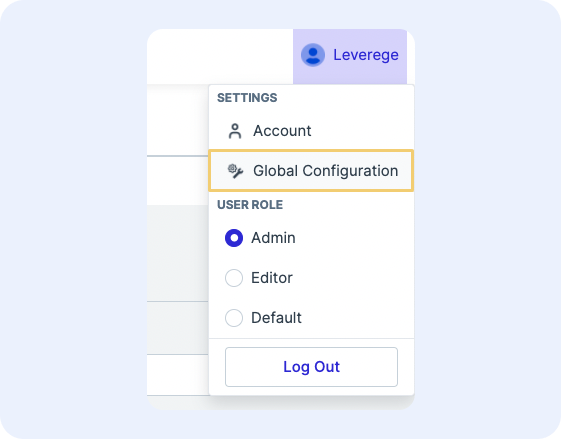
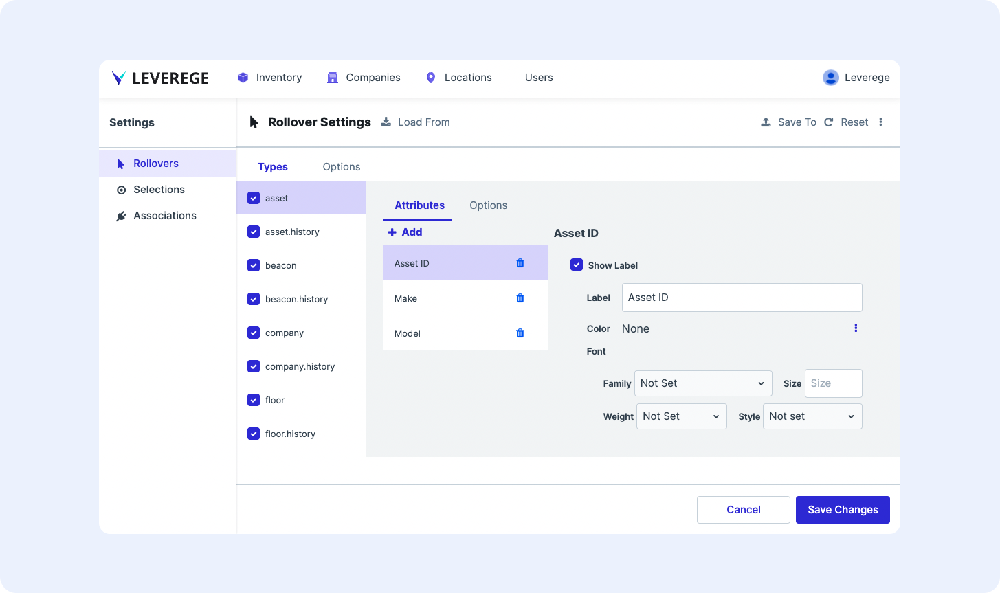

# Rollovers and Selections

Users can configure the appearance of the rollover card that surface when a user mouses over either a table entry or map icon. They can also configure the appearance of the selection card that surfaces when a user selects an entry on a table or map.

!!! Note "Card appearance"
    Rollover and selection cards will only appear when a map component is shown on the page.

## Accessing the Rollover Configuration

To access the rollover configuration, click the user account settings menu in the upper right of the page and select **Settings > Global Configuration**. 

<figure markdown>
{ width="450" }
  <figcaption>Global configuration settings</figcaption>
</figure>

* To configure the rollover card, select the **Rollovers** list item under **Settings**
* To configure the selection card, select the **Selections** list item under **Settings**

<figure markdown>
{ width="800" }
  <figcaption>Rollover configuration panel</figcaption>
</figure>

## Configuring The Rollover & Selection Card

The configurable settings of the rollover and selection cards are the same. The following section describes the configuration settings of the rollover and selection cards.

### Available Blueprints for Card Display

The list of available blueprints/objects that can display rollovers are listed in the Types menu.

Each item corresponds to an element on the UI. For example, there may be an entry for `assets` that corresponds to the card that appears when rolling over or selecting an `asset` on the map. 

Each entry will also have an associated `.history` item - this is the configuration for when a user rolls over or selects an item in a history list viewer.

### Attribute Configuration

#### Label

The Label section allows users to configure properties about the label on attributes added to the card.

* **Show Label/Label Name**: To show the name of the attribute in the card next to the value, check the box next to **Show Label** and input the name of the Label. To hide the name of the attribute (e.g. show the value only), uncheck the box.
* **Label Color**: To set the color of the label text, click the 3-dot button and select **Color**. Specify a color in the field that appears. To set the color back to the default color, click the 3 dot bottom and select **None**.
* **Label Font**: To set the label’s font family, size, weight, and style, change the appropriate fields in the **Font** section
* **Label Justify/Align**: To set the label text justification and alignment, change the **Justify** and **Align** fields
* **Label Allow Text Wrap**: To allow the text of the label to wrap, check the box next to **Allow Text Wrap**. To prevent the label text from wrapping (it will get truncated instead), clear the checkbox.

#### Value

The Value section allows users to configure properties about the values displayed on the card.

* **Value Show if Empty**: To show a value if the attribute is empty, check the box next to **Show if Empty**. To hide the value if the attribute is empty, uncheck the box.
* **Empty Value**: To set the value that appears if the attribute is empty, specify the value in the **Empty Value** field. Common options are double dashes ( `--` ) or blank.
* **Value Color**: To set the color of the value text, click the 3-dot button and select **Color**. Specify a color in the field that appears. To set the color back to the default color, click the 3 dot bottom and select **None**.
* **Value Font**: To set the value text’s font family, size, weight, and style, change the appropriate fields in the **Font** section.
* **Value Justify/Align**: To set the value text justification and alignment, change the **Justify** and **Align** fields.
* **Value Allow Text Wrap**: To allow the text of the value to wrap, check the box next to **Allow Text Wrap**. To prevent the value text from wrapping (it will get truncated instead), clear the checkbox.
* **Value Background**: To set the color of the value background text, specify a color in the **Background** field. *Note: This only changes the color around the text, it does not change the color of the entire cell.*

#### Attribute Options

* **Variant**: To have the card use a particular variant in UI builder, set the desired variant name in the **Variant** field
* **Background**: To set the color of the card background, specify a color in the **Background** field. *Note: Unless overridden by the even/odd row background color configuration, the rows of the card will alternate between the specified background color and a secondary color that is slightly lighter than background color.*
* **Even Row Background**: To set the background color of even numbered rows, specify a color in the **Even Row Background** field.
* **Odd Row Background**: To set the background color of odd numbered rows, specify a color in the **Odd Row Background** field.
* **Title Color**: To set the color of the card title, specify a color in the **Title Color** field.
* **Default Label Color**: To set a default color for the attribute labels on a card, specify the color in the **Default Label Color** field. This configuration is overridden by an attribute’s label color configuration.
* **Default Value Color**: To set a default color for the attribute values on a card, specify the color in the **Default Value Color** field. This configuration is overridden by an attribute’s value color configuration.
* **Default Suffix Color**: To set the default suffix color, specify the color in the **Default Suffix Color** field.
* **Header Visible**: To show the header/title of the card, check the box next to **Header Visible**. To hide the header/title of the card, uncheck the box.
* **Title Attribute**: To specify which attribute is shown in the title of the card, indicate the name of the attribute in the **Title Attribute** field. This should match the name of the tag applied to the attribute of the Blueprint (e.g. if the asset ID attribute in the blueprint has a tag of `is:name`, then put “name” into the **Title Attribute** field).
* **Icon Attribute**: To set the icon used in the card, leave the attribute as `icon`. Change the `typeIcon` URL in the blueprint’s metadata to change the icon image.
* **Icon Size**: To set the size of the icon, specify the size with `px` added at the end.

#### Display Options

These settings are found in the **Display** tab next to the **Types** tab.

* **Visible**: To toggle whether rollovers are visible or hidden across the entire UI, check or uncheck the **Visible** checkbox.
* **Placement**: Specify the placement of the card on the map when mousing over (in the case of a rollover card) or selecting (in the case of a selection card) a table entry
* **Pointer Placement** *(rollovers only)*: Specify the placement of the rollover card on the map when mousing over an icon/object on the map. This placement is relative to the user’s pointer when they roll over an icon. It is independent of the **Placement** field which indicates the location of the rollover card upon table entry rollover.

