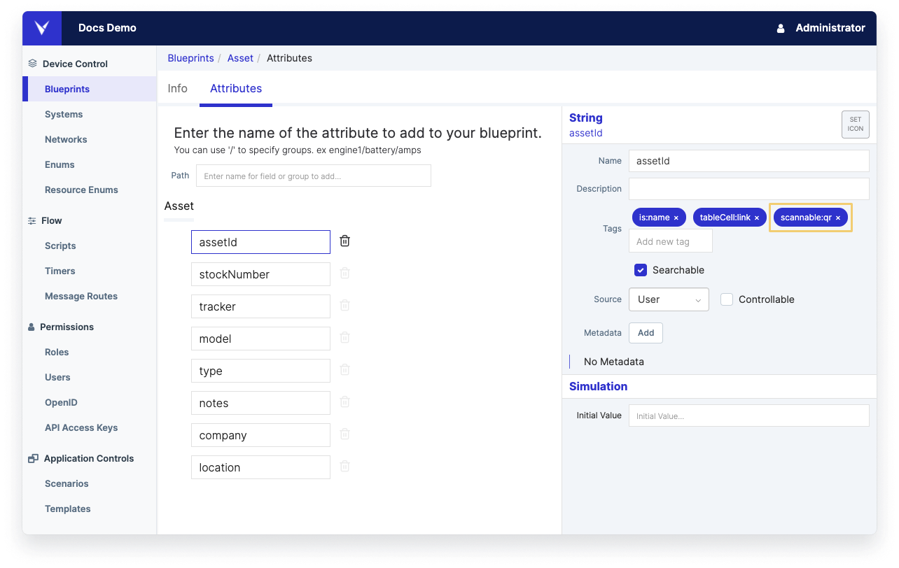
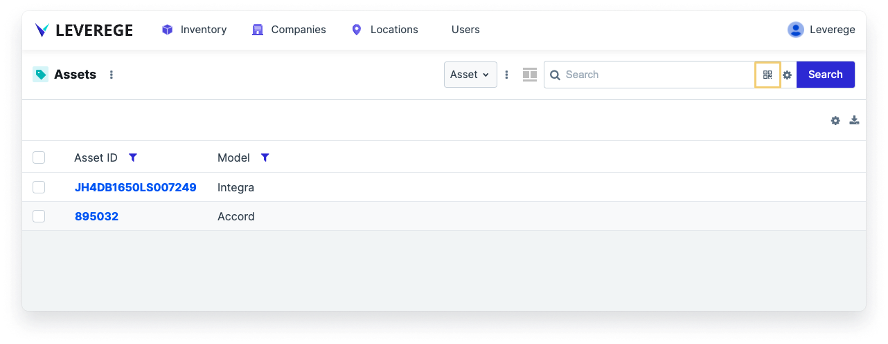

# Configuring the Search Bar

Users can configure which fields are searchable on a given dashboard. When a user searches for one or more terms in the search bar, the system will search among the selected fields for a result.

## Accessing the Search Configuration

To access the search configuration panel, click the gear icon on the right side of the search bar.

<figure markdown>
{ width="500" }
  <figcaption>Example configuration panel for search bar component</figcaption>
</figure>

## Configuring Search

To select a field to be included in the search, check the box next to the field. Changes performed here will be applied to the currently shown dashboard.

To reset the search criteria to the default for the persona, click the Reset button in the upper right of the panel.

!!! Note "Default search behavior"
    Having nothing selected will default to searching all fields.

## Enabling QR Code Scanning on the Search Bar

To enable QR code scanning on the search bar, use the `scannable:qr` tag on the attribute of the blueprint to be searched.

This will add a QR code icon in the search bar when the attribute is configured to be among the searchable fields. The QR code icon will be hidden if the attribute is not configured to be among the searchable fields.

If a QR code contains multiple terms that need to be parsed prior to search, set the `scanTextHandler` path in the attribute metadata. 

See the attribute documentation for `scanTextHandler` for more details.

<figure markdown>
{ width="600" }
</figure>
<figure markdown>
{ width="600" }
  <figcaption>Top: Adding the scannableQr tag on the asset.assetId attribute  Bottom: The QR scan icon on the Assets search bar</figcaption>
</figure>

## Saving Search Configuration to Personas

To save a search configuration to a version or persona, make the desired changes to the search and then click the checkmark next to the dashboard selector. This will save the search configuration to the currently shown dashboard. Use the **Advanced** button on the search configuration panel to save the configuration to a specific version.
 