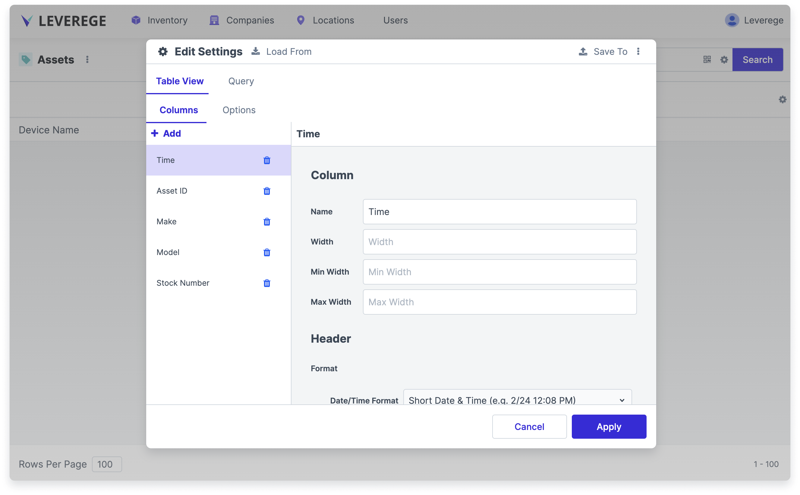

# History Table Viewer

A History Table Viewer is a component that displays historical data on the devices, assets, and related blueprints in a table format.

## Accessing the History Table Viewer Configuration

To access the history table configuration, click the gear icon in the upper right of the component and select **Edit Settings**.

## Configuring the History Table Viewer

<figure markdown>
{ width="600" }
  <figcaption>History table viewer configuration panel</figcaption>
</figure>

### History Screen Options

The history table view is organized by columns. The currently displayed columns are shown in the list on the left side of the panel.

To add a column to the table, click **Add > [new column]**.
To reorder the columns, click and drag the column you wish to reorder into the desired location in the list.

#### Column Configuration

* **Column Name**: To edit the display name of the column, change the **Column Name** field
* **Column Width**: To set the default width of the column, change the **Column Width** field
* **Column Min and Max Width**: To set the minimum and maximum allowable width of the column, set the **Min Width** and **Max Width** fields

#### Header Configuration

* **Header Color**: To set the color of the column Header text, click the 3-dot button and select **Color**. Specify a color in the field that appears. To set the color back to the default color, click the 3 dot bottom and select **None**.
* **Header Font**: To set the header’s font family, size, weight, and style, change the appropriate fields in the **Header Font** section
* **Header Justify/Align**: To set the header text justification and alignment, change the **Justify** and **Align** fields
* **Header Allow Text Wrap**: To allow the text of the header to wrap, check the box next to **Allow Text Wrap**. To prevent the header text from wrapping (it will get truncated instead), clear the checkbox.
* **Header Background**: To set the color of the header background text, specify a color in the **Background** field. *Note: This only changes the color behind the text, it does not change the color of the header cell.*

#### Cell Configuration

The Cell configuration section refers to text in the main body of the table. 

* **Cell Empty Value**: To set the value that appears if the cell contents are empty, specify the value in the **Empty Value** field. Common options are double dashes ( `--` ) or blank.
* **Cell Color**:  To set the color of the cell text, click the 3-dot button and select **Color**. Specify a color in the field that appears. To set the color back to the default color, click the 3 dot bottom and select **None**.
* **Cell Font**: To set the cell’s font family, size, weight, and style, change the appropriate fields in the **Cell Font** section
* **Cell Justify/Align**: To set the cell text justification and alignment, change the **Justify** and **Align** fields
* **Cell Allow Text Wrap**: To allow the text of the cell to wrap, check the box next to **Allow Text Wrap**. To prevent the cell text from wrapping (it will get truncated instead), clear the checkbox.
* **Cell Background**: To set the color of the cell background text, specify a color in the **Background** field. *Note: This only changes the color behind the text, it does not change the color of the entire cell.*

#### Query Options

In the **Options** menu next to the **Editor** tab, users can configure the query parameters and aspects on how the data results are displayed.

* **Per Page**: To set how many results are loaded per page, change the Per Page field to the desired number of results. Users with the correct permissions can also edit this amount in the bottom of the component when data is displayed
* **Query Mode**: To set what scope data is displayed, change the **Query Mode**:
    * **Selected**: Historical data is shown for devices/assets that are selected (clicked on the map)
    * **Targeted**: Historical data is shown for devices/assets that are targeted (checkbox checked in a list)
    * **All**: Historical data is shown for all devices/assets
* **Query Range**: To set the time range of data that the historical query uses, use the date picker to select a predefined range (e.g. Last 7 Days, Last 30 Days) or a specific date range.