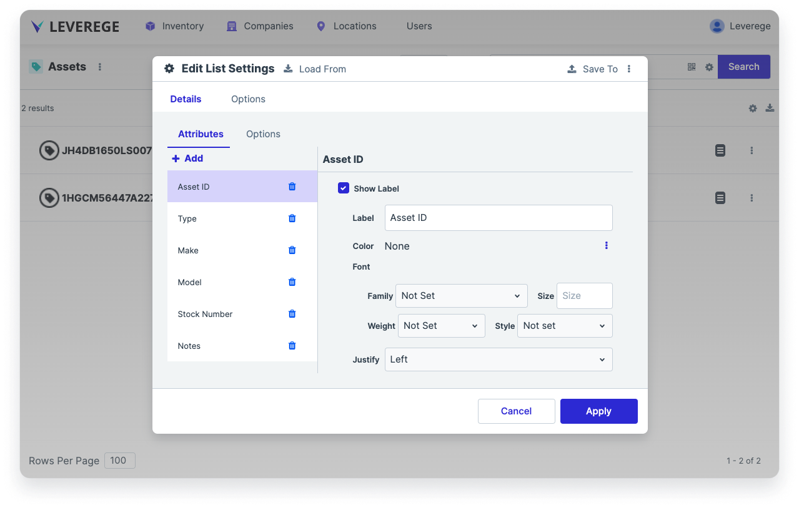

# List Viewer

The list viewer is a UI component that shows data as a list of cards. The data fields shown in each card is configurable by the user.

## Accessing the List Viewer Configuration ##

To access the responsive table configuration, click the gear icon in the upper right of the component and select **Edit Settings**.

## Configuring the List Viewer

The list viewer shows data in a card format. By default, the primary label on the card corresponds to the primary name attribute of the blueprint of the page (e.g. Vehicles). This can be changed in the **Options > Title Attribute** field by specifying the desired title in the format `[blueprintName].[attribute]`.

<figure markdown>
{ width="600" }
  <figcaption>List viewer configuration panel</figcaption>
</figure>

The currently displayed attributes are shown in the list on the left side of the panel.

To add attributes to the card, click the **Attributes > Add** button and select the desired attribute. 

To reorder the attributes, click and drag the attribute you wish to reorder into the desired location in the list.

### Attribute Configuration

#### Label

The Label section allows users to configure properties about the label on attributes added to the card.

* **Show Label/Label Name**: To show the name of the attribute in the card next to the value, check the box next to **Show Label** and input the name of the Label. To hide the name of the attribute (e.g. show the value only), uncheck the box.
* **Label Color**: To set the color of the label text, click the 3-dot button and select **Color**. Specify a color in the field that appears. To set the color back to the default color, click the 3 dot bottom and select **None**.
* **Label Font**: To set the label’s font family, size, weight, and style, change the appropriate fields in the **Font** section
* **Label Justify/Align**: To set the label text justification and alignment, change the **Justify** and **Aligns** fields
* **Label Allow Text Wrap**: To allow the text of the label to wrap, check the box next to **Allow Text Wrap**. To prevent the label text from wrapping (it will get truncated instead), clear the checkbox.

#### Value

The Value section allows users to configure properties about the values displayed on the card.

* **Value Show if Empty**: To show a value if the attribute is empty, check the box next to **Show if Empty**. To hide the value if the attribute is empty, uncheck the box.
* **Empty Value**: To set the value that appears if the attribute is empty, specify the value in the **Empty Value** field. Common options are double dashes ( `--` ) or blank.
* **Value Color**: To set the color of the value text, click the 3-dot button and select **Color**. Specify a color in the field that appears. To set the color back to the default color, click the 3 dot bottom and select **None**.
* **Value Font**: To set the value text’s font family, size, weight, and style, change the appropriate fields in the **Font** section.
* **Value Justify/Align**: To set the value text justification and alignment, change the **Justify** and **Aligns** fields.
* **Value Allow Text Wrap**: To allow the text of the value to wrap, check the box next to **Allow Text Wrap**. To prevent the value text from wrapping (it will get truncated instead), clear the checkbox.
* **Value Background**: To set the color of the value background text, specify a color in the **Background** field. *Note: This only changes the color around the text, it does not change the color of the entire cell.*

#### Attribute Options

* **Variant**: To have the card use a particular variant in UI builder, set the desired variant name in the **Variant** field
* **Background**: To set the color of the card background, specify a color in the **Background** field. *Note: Unless overridden by the even/odd row background color configuration, the rows of the card will alternate between the specified background color and a secondary color that is slightly lighter than background color.*
* **Even Row Background**: To set the background color of even numbered rows, specify a color in the **Even Row Background** field.
* **Odd Row Background**: To set the background color of odd numbered rows, specify a color in the **Odd Row Background** field.
* **Title Color**: To set the color of the card title, specify a color in the **Title Color** field.
* **Default Label Color**: To set a default color for the attribute labels on a card, specify the color in the **Default Label Color** field. This configuration is overridden by an attribute’s label color configuration.
**Default Value Color**: To set a default color for the attribute values on a card, specify the color in the **Default Value Color** field. This configuration is overridden by an attribute’s value color configuration.
* **Default Suffix Color**: To set a default suffix color for the attribute on a card, specify the color in the **Default Suffix Color** field.
* **Header Visible**: To show the header/title of the card, check the box next to **Header Visible**. To hide the header/title of the card, uncheck the box.
* **Title Attribute**: To specify which attribute is shown in the title of the card, indicate the name of the attribute in the Title Attribute field. By default it is `name`. To specify another attribute, use the format `[blueprintName].[attribute]` (e.g. `asset.vin`).
* **Icon Attribute**: To set the icon used in the card, leave the attribute as `icon`. Change the `typeIcon` URL in the blueprint’s metadata to change the icon image.
* **Icon Size**: To set the size of the icon, specify the size with `px` added at the end.

#### Display Options 

In the **Options** tab next to **Detail**, select the Display option from one of the following:

* Default
* Block
* Inline
* Inline Block

