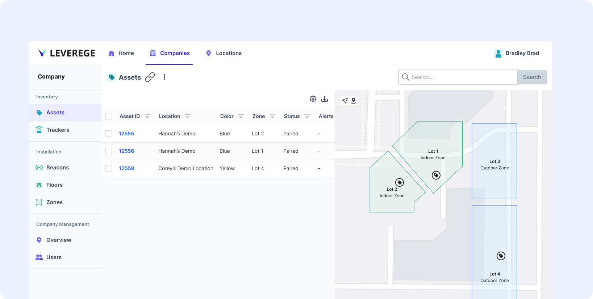
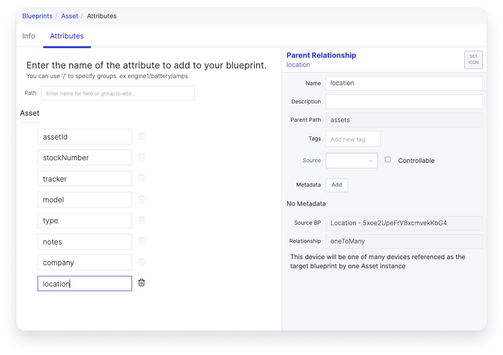

# Parent Data Columns in Tables

Sometimes, you want  to show the parent on the child table. You can see an example of this below, where the table is showing the parent location of the asset. In this guide, we'll show you how to set that up in your interface.

<figure markdown>
{ width="700" }
  <figcaption>Parent table column example</figcaption>
</figure>


To add and configure parent columns in the child blueprint's table, you can add metadata to the parent attribute on the child blueprint. 

<figure markdown>
{ width="700" }
  <figcaption>Edit metadata of parent attribute</figcaption>
</figure>

For the setter metadata, there are two values you need to understand, `path` and  `sourcePath`.

| Setter Value | Description |
|-------|---------|
| `path` | The path of the current blueprint you are trying to configure the parent column for. Paths determine where you are in the UI looking at this blueprint. |
| `sourcePath` | The path of the parent you are trying to load into the chid table. |

For example, if your root is Location which has a one to many relationship with Assets and you are on the assets page in a given location, your path would be `location.assets` and your source path would be `location`. Whether you use singular or plural depends on the type of relationship. If it was a one-to-one relationship, your path would look like `location.asset`. 

Alternatively, if your root was company and company had a one-to-many relationship with locations while locations still had a one-to-many relationship with assets, your path and sourcePath would be `company.locations.assets`  &  `company.locations` respectively. 

For our final example, lets say both your location blueprint and asset blueprint are roots and you want to load the location column into the root-level asset page. In this case your path is  `asset` and your source path is `location`. Both will be singular since they are roots.

### Metadata Example

```json
{
  "setter": {
    "parentSources": [
      {
        "path": "location.assets",
        "sourcePath": "location"
      },
      {
        "path": "company.locations.assets",
        "sourcePath": "company.locations"
      },
      {
        "path": "asset",
        "sourcePath": "location"
      }
    ]
  }
}
```


## Copying Parent Attributes onto the Child

Along with enabling the parent to show up in the child table, you can also copy attributes from the parent onto the child. Note that this only gets updated when a relationship is created. If the attribute is changed on the parent later, the **copied value on the child does not update**.

| Setter Value | Description |
|-------|---------|
| `child` | Child represents the attribute on the child blueprint you want to copy the value to. The format should follow `blueprint.attribute`. Note that if you have your attributes in a group it may look like `blueprint.group.attribute` |
| `copyNull` | If the value is null, you can either copy the value by setting this to true or ignoring the value by setting this to false |
| `parent` | Parent represents the attribute from the parent blueprint you want to copy onto the child. The format is the same as the child value.  |

### Metadata Example

```json
{
  "setter": {
      "copyValues": [
        {
          "child": "asset.address",
          "copyNull": true,
          "parent": "location.address"
        }
    ],
  }
}
```

## Running Functions Against the Parent Value

When copying the value from the parent, sometimes you want to run a function against it to get the correct child data. The two valid options for this are `geoJsonCenter` and `geoJsonCenterOfMass`, which are only usable with a parent geoShape value and a geoPoint child value. If type is not set, the parent value will be copied to the child. The types must be the same.

| Setter Value | Description |
|-------|---------|
| `geoJsonCenter` | If you drew a box around the geoshape, this represents the center of that box. |
| `geoJsonCenterOfMass` | This represents the geometric center of the geoshape, the arithmetic mean position of all of the points ini the figure. |

A good use case example for this function is beacon installation  into zones. When installing beacons, you might want them to automatically be placed in the center of a zone, in which case you would want to use `type:geoShapeCenterOfMass`


```json
{
  "setter": {
       "copyValues": [
         {
           "child": "beacon.position",
           "copyNull": false,
           "parent": "zone.area",
           "type": "geoShapeCenterOfMass"
         }
    ]
  }
}
```
