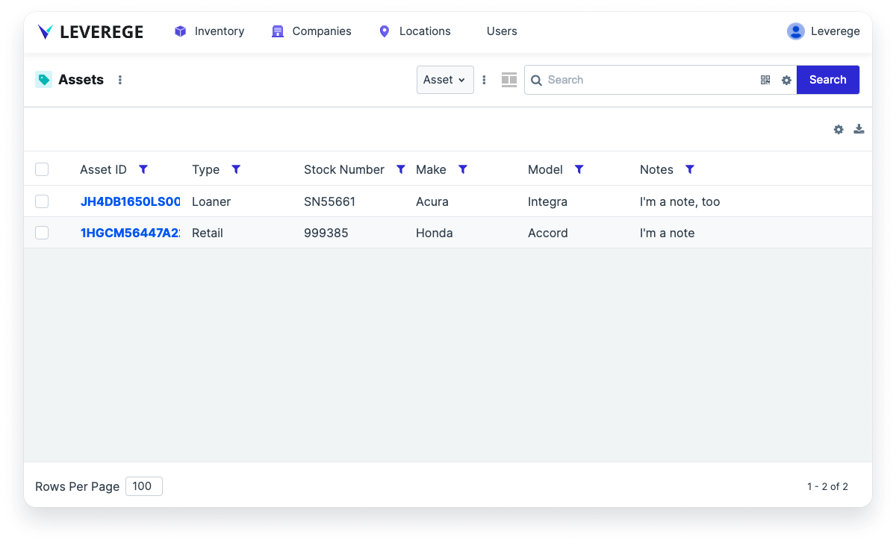
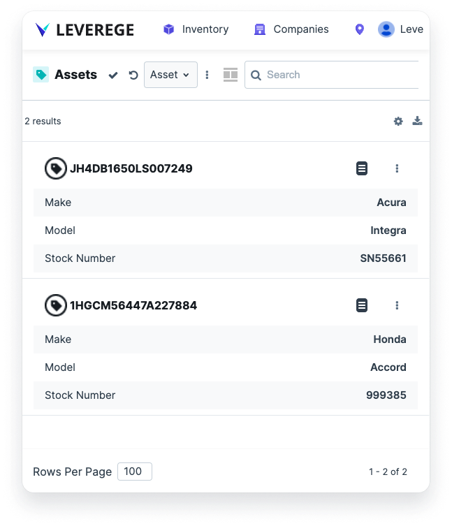

# Responsive Table

A responsive table is a component that changes its presentation of its data based on the size of the page or panel that it occupies. When a user drags the boundaries of a responsive table to smaller than a given threshold or resizes the page, the view switches from a table viewer to a list viewer.

!!! Tip "Table/List"
    The responsive table is called **Table/List** when selecting it from the layout controller.

<figure markdown>
{ width="600" }
  <figcaption>View of responsive table showing as a table viewer when component is expanded</figcaption>
</figure>

<figure markdown>
{ width="300" }
  <figcaption>View of responsive table showing as a list viewer when component is collapsed</figcaption>
</figure>

## Accessing the Responsive Table Configuration

To access the responsive table configuration, click the gear icon in the upper right of the component and select **Edit Settings**.

## Configuring the Responsive Table

To configure a responsive table, users must configure both:

* The expanded table viewer and 
* The collapsed list viewer

To do so, users edit the configuration when the responsive table is expanded, and then users collapse the table and edit the configuration when the responsive table is collapsed. The responsive table will pull from the same configuration as the “static” versions of the table viewer and the list viewer.

!!! Note "Table and list viewer configuration"
    Please refer to the sections on the table viewer and the list viewer for more details on how to configure the components which make up the responsive table.