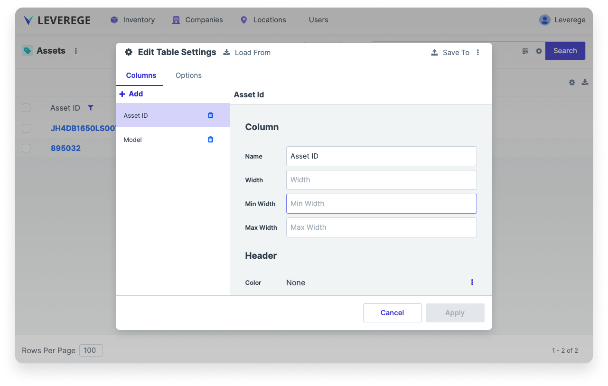

# Table Viewer

The table viewer is a component which displays real-time data of devices, assets, or related blueprints in a table form.

## Accessing the Table Viewer Configuration

To access the table configuration, click the gear icon in the upper right of the component and select Edit Settings.

## Configuring the Table Viewer

<figure markdown>
{ width="600" }
  <figcaption>Table viewer configuration panel</figcaption>
</figure>
The table view is organized by columns. The currently displayed columns are shown in the list on the left side of the panel.

To add a column to the table, click **Add > [new column]**.

To reorder the columns, click and drag the column you wish to reorder into the desired location in the list.

### Column Configuration

* **Column Name**: To edit the display name of the column, change the **Column Name** field
* **Column Width**: To set the default width of the column, change the **Column Width** field
* **Column Min and Max Width**: To set the minimum and maximum allowable width of the column, set the **Min Width** and **Max Width** fields

### Header Configuration

* **Header Color**: To set the color of the column Header text, click the 3-dot button and select **Color**. Specify a color in the field that appears. To set the color back to the default color, click the 3 dot bottom and select **None**.
* **Header Font**: To set the header’s font family, size, weight, and style, change the appropriate fields in the **Header Font** section
* **Header Justify/Align**: To set the header text justification and alignment, change the **Justify** and **Align** fields
* **Header Allow Text Wrap**: To allow the text of the header to wrap, check the box next to **Allow Text Wrap**. To prevent the header text from wrapping (it will get truncated instead), clear the checkbox.
* **Header Background**: To set the color of the header background text, specify a color in the **Background** field. *Note: This only changes the color behind the text, it does not change the color of the header cell.*

### Cell Configuration

The Cell configuration section refers to text in the main body of the table. 

* **Cell Empty Value**: To set the value that appears if the cell contents are empty, specify the value in the **Empty Value** field. Common options are double dashes ( `--` ) or blank.
* **Cell Color**:  To set the color of the cell text, click the 3-dot button and select **Color**. Specify a color in the field that appears. To set the color back to the default color, click the 3 dot bottom and select **None**.
* **Cell Font**: To set the cell’s font family, size, weight, and style, change the appropriate fields in the **Cell Font** section
* **Cell Justify/Align**: To set the cell text justification and alignment, change the **Justify** and **Align** fields
* **Cell Allow Text Wrap**: To allow the text of the cell to wrap, check the box next to **Allow Text Wrap**. To prevent the cell text from wrapping (it will get truncated instead), clear the checkbox.
* **Cell Background**: To set the color of the cell background text, specify a color in the **Background** field. *Note: This only changes the color behind the text, it does not change the color of the entire cell.*

### Allowing fields to be editable

To enable fields in the table to be editable by user input, click the gear icon in the upper right of the component and select **Editable**. In addition, the fields must be set to Source = `User` in Architect. This will make the following types of fields editable on the table by creating dropdowns:

* Attributes that represent parent blueprints (e.g. the Company of an Asset). These fields must be populated using parent setters in Architect. See the documentation on setters for more information.
* Attributes that are associated in a one-to-one relationship with the blueprints of the current page. For example, if assets and trackers are paired one-to-one, the Tracker field on the Assets table can be made editable, which will expose a dropdown listing all trackers for pairing
* Fields using enum types (e.g. a discrete set of possible values)