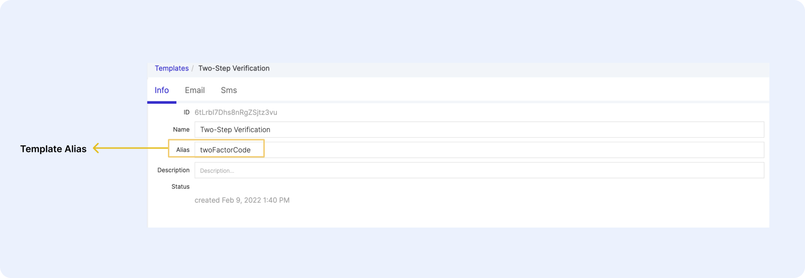

# Two-Step Verification

## Enabling Two-Step Verification in Your Architect Project

Two-step Verification offers enhanced security to users by requiring two distinct factors of Verification in order to gain access to their account. Two-Step Verification is automatically enabled on all projects by default, but you will need to add the email and SMS templates in order for the feature to work.

### Create Your Two-Step Verification Email & SMS Template

Start by going to Templates in Architect and create a blank template. You can use whatever display name you would like for this template, but the alias must be `twoFactorCode` . 

<figure markdown>
{ width="700" }
  <figcaption>Template Alias Input Field</figcaption>
</figure>

For the email template, you can change the text, images, and styling to whatever you would like, but please note that you will have to use `{{code}}` wherever you want the Verification code to appear. You can even add it to the subject line of the email. 

### Email Example

``` json 

<div style="font-family:Inter, sans-serif; max-width:600px; min-width:200px; background-color: #181e25; margin: 0 auto;">
        <div style="background-color:white; padding: 32px 32px 32px 32px; text-align: left;">
          
          <hr class="solid" style="border: 1px solid #e7eaef">
    <div style="text-align:left; font-size:20px; line-height:28px; font-weight: bold; margin: 24px 0px;">
      Sign In
    </div>
    <div style="text-align:left; font-size:16px; line-height:26px; margin: 24px 0px;">
        Your two-step verification code is below. Enter the code in your open browser window and we'll help you get signed in. This code expires in 5 minutes.
    </div>
    <div style="font-weight: bold; overflow:auto; background-color: #f0f6ff; padding: 15px; border-radius: 5px; text-align: center;">
      <span style="color:black; padding:10px 20px; border-radius:5px; font-size: 24px;">
        {{code}}
      </span>
    </div>
    <div style="text-align:left; font-size:16px; line-height:26px; margin: 24px 0px;">
        If you didn't request this email, there's nothing to worry about - you can safely ignore it.
    </div>
  </div>
  <div style="background-color:#e7eaef; padding: 11px;">
    <div style="text-align:center; font-size:12px; line-height:18px;">
      Copyright Leverege, LLC. All Rights Reserved.
    </div> 
  </div>
</div>

```

### SMS Example

<figure markdown>
{ width="700" }
  <figcaption>SMS Example</figcaption>
</figure>


``` json 
{{code}} is your security code for Leverege. If you did not request this code, you can safely ignore this message.
```


## Enabling Two-Step Verification As a User

Two-Step Verification is optional for users. Therefore, users have to go into their Account Settings, under Security, to enable the feature and start using Two-Step Verification.

### Security Settings in User Account Settings

Users have the option to enable email, SMS, and/or an authenticator app (such as the Google Authenticator App) to use as their second factor of Verification. Users can update or disable Two-Step Verification at any time. 

!!! Tip "Email & Phone Number "
    If a user enables email or SMS as their second factor of Verification, they will be asked to provide the email or phone number they wish to use for that Verification method. The email and phone number are NOT synced or linked to their contact email and phone number. 

Once a user enables their first method of Two-Step Verification, they will be given a list of Backup Codes that can be used in the event that they are locked out of their Two-Step Verification method (e.g. their phone is dead or their email has been compromised and they no longer have access to it). 

### Using Two-Step Verification with One-Time Access Codes

If your project also has One-Time Access Codes enabled, users have the option to use a code sent via email or SMS to log into their account instead of providing a password. If a user has Two-Step Verification enabled, they will still need to provide an additional, distinct factor of Verification when logging in. 

Let’s look at a specific edge case to illustrate this point. Let’s say that we have a user who has Two-Step Verification enabled, but their only method of Verification is email. If the users attempts to use email to receive their One-Time Access Code, they will receive an email with an error message instead of their One-Time Access Code:

This is because they are attempting to use email as both factors of Verification, but our system requires that the two factors be distinct. It is therefore recommended that users have at least two methods of Two-Step Verification enabled if they are going to also use One-Time Access Codes. In the even that this does happen to a user, they can simply return to the login screen and use or reset their password to login or select a different method for their One-Time Access Code. 

This error email also needs to be configured as a template in your project. To enable it, start by going to Templates in Architect and create a blank template. You can use whatever display name you would like for this template, but the alias must be `loginCodeError` . Below are examples of the email and SMS HTML that you’ll want to you’ll want to use in your template.

Email Example:

``` json
<div style="font-family:Inter, sans-serif; max-width:600px; min-width:200px; background-color: #181e25; margin: 0 auto;">
        <div style="background-color:white; padding: 32px 32px 32px 32px; text-align: left;">
          
          <hr class="solid" style="border: 1px solid #e7eaef">
    <div style="text-align:left; font-size:20px; line-height:28px; font-weight: bold; margin: 24px 0px;">
      Error: Access Code Not Available
    </div>
    <div style="text-align:left; font-size:16px; line-height:26px; margin: 24px 0px;">
        You have enabled two-step verification with this email. One-Time access codes are not available using the same method as two-step verification. 
        <br><br>Please choose another one-time access code method or sign with your credentials.
    </div>
  </div>
  <div style="background-color:#e7eaef; padding: 11px;">
    <div style="text-align:center; font-size:12px; line-height:18px;">
      Copyright Leverege, LLC. All Rights Reserved.
    </div> 
  </div>
</div>

```

SMS Example:

``` json
You have enabled two-step verification with this phone number. One-Time access codes are not available using the same method as two-step verification. Please choose another one-time access code method or sign with your credentials.

```
