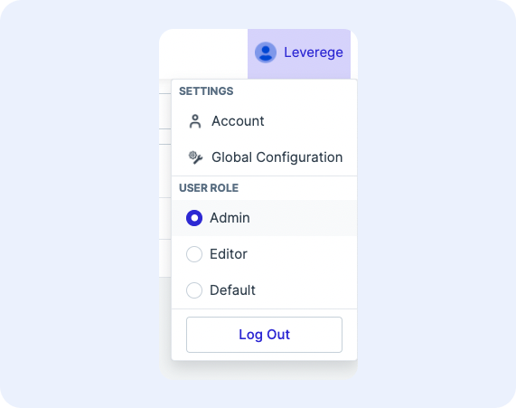
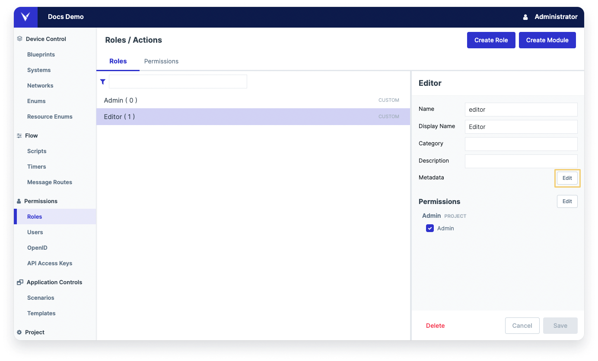

# Multi-Role Management
​
Users can be assigned one or more roles in a project. Each role may contain a different set of views, visible data fields, and actions. It's common for users to switch between roles in order to perform their desired task. 

It's also common for **administrator-type** users to have multiple roles because to assign a role to a new or current user, the administrator must already have that role themselves.
​
!!! Note "Creating Roles and Managing Users"
    For information on how to create users, see the documentation on Roles and Permissions.
    For information on how to assign roles to and manage users, see the documenetation on User Management.
​
## Switching Between Roles
​
To switch between assigned roles in an application:
​

1. Click the username in the upper right corner to access the role selector
1. A dropdown should appear which contains the list of available roles under **User Role**
1. Select a the desired role and the UI will reload the view according the newly selected role
​
<figure markdown>
{ width="400" }
  <figcaption>Switching among assigned roles</figcaption>
</figure>
​

!!! Note "Actions for users with multiple roles"
    If a user has multiple roles with varying degrees of action permissions, they will still be able to perform actions of their highest privilege role when the lowest-privileged role is selected. For example, if a user has an Editor role that can edit assets and Viewer role that can only view assets, they would still be able to edit assets while they have Viewer role selected.


## Ordering the Roles in the Role Selector
​
To define the order of roles presented in the role selector dropdown, use the `priority` property in the metadata of a role. The `priority` property is an integer to represent the rank, with `0` being the highest priority.
​

To order the roles in the role selector:
​

1. In Architect, navigate to **Permissions > Roles**
1. Select a role and edit the metadata by clicking the **Edit** button in the **Metadata** section (see screenshot below for reference)
1. Add the `priority` property in top level of the metadata. There may be other properties in the metadata already:

    ``` json hl_lines="8"
    {
        "ui":{
        ...
        },
        ...
        "usedAtBlueprints":...
        ...
        "priority": 0
        ...
    }
    ```

1. Click **OK** to close the **Metadata** popup
1. Click **Save** in the role panel on the right to save the metadata to the role
1. Repeat the steps for all remaining roles on the project
​
The roles will be ordered top to bottom from highest priority (smallest number) to lowest priority (largest number).
​
<figure markdown>
{ width="800" }
  <figcaption>Editing role metadata</figcaption>
</figure>
