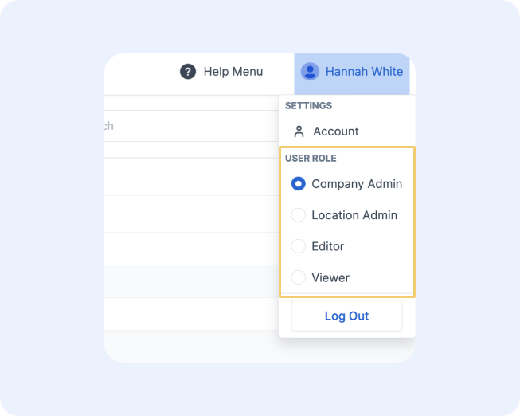

# Multi-Role Management

It's common that some users may have multiple roles in the system. Especially **administrator-type** roles. This is because to assign a role to a new or current user, you must already have that role yourself. 

Thus, some users have multiple roles. Our system allows those users to toggle between the different UI experiences for those roles under the account dropdown in the top right corner. This will change the UI to the one configured for the selected role. Note that if you have all four of the roles below and selected the viewer role, you would still be able to perform actions around the UI that a Company Administrator can, you would just see the different dashboards & maps available to the viewer.

<figure markdown>
{ width="700" }
  <figcaption>Role Picker</figcaption>
</figure>

