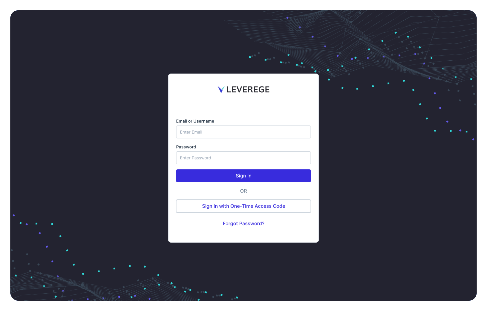
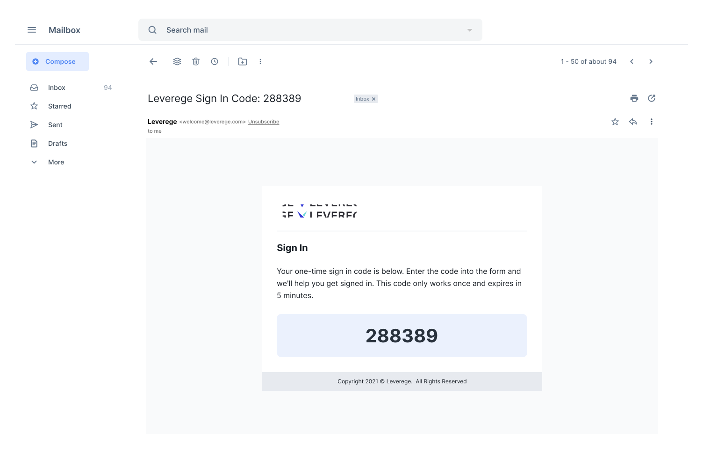

# One-Time Access Code

The one-time access code feature is enabled or disabled at the project level. If the feature is enabled, any user registered in our system can request a one-time access code via the email address associated with their account. The code can be sent via email or text, as long as the user has a phone number tied to their account. The one-time access code button can be found on the login screen (image below).

<figure markdown>
{ width="700" }
  <figcaption>Login Screen</figcaption>
</figure>

An example of the email is below. If you want to customize your email, review our [email configuration & styling](../../../setup/branding/notifications/) help guide.

<figure markdown>
{ width="700" }
  <figcaption>Access Code Email</figcaption>
</figure>
