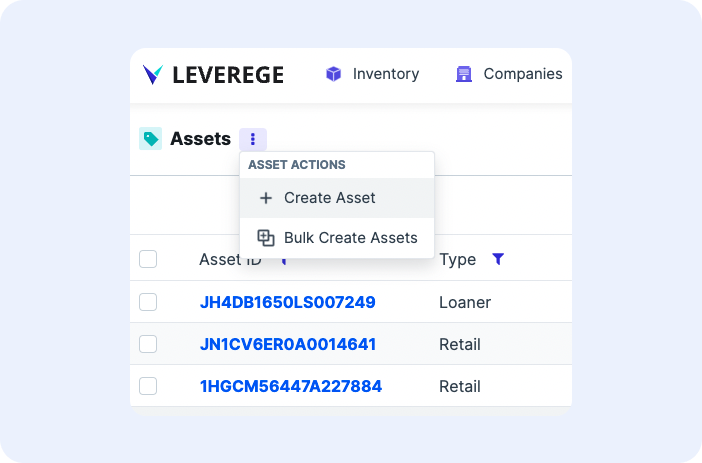
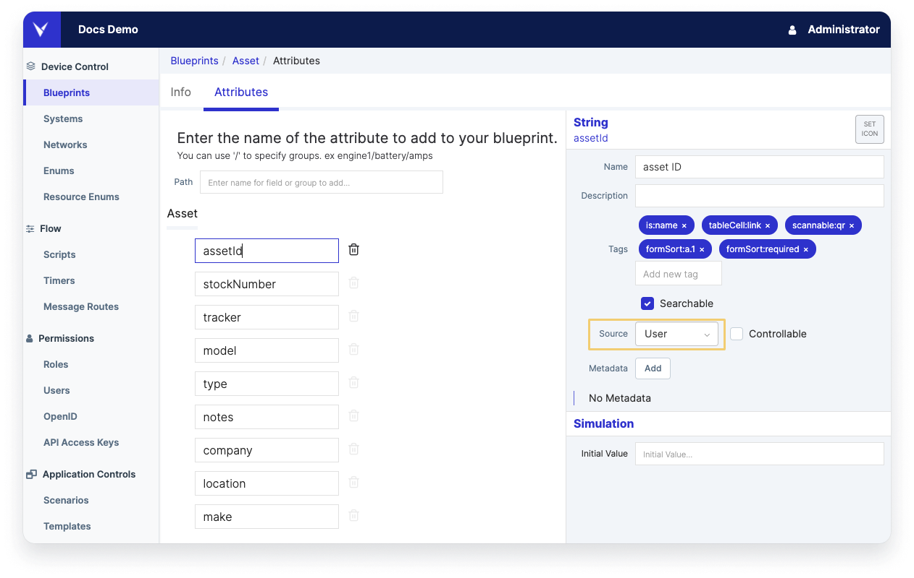
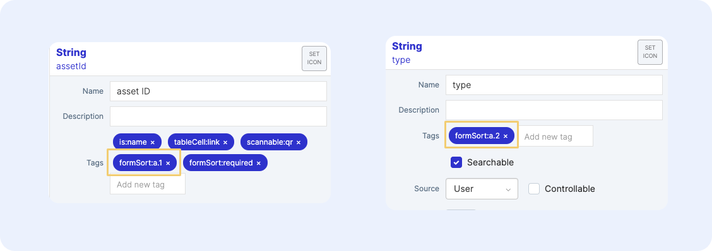
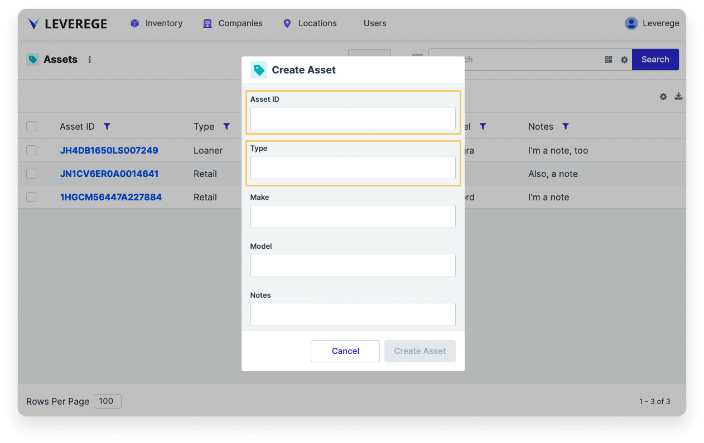
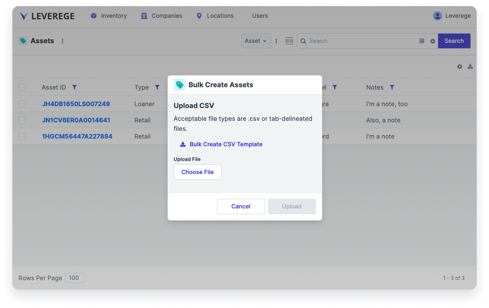

# Create & Edit Actions 

A powerful and handy feature of the Leverege IoT Stack is the ability to create and edit every type of object in the system, both individually and in bulk. 

Users, especially those with admin roles, will often need to upload objects like assets or devices into the application. Once they create the object, they may also want the ability to edit the object, remove the object from a specific level of the application, or remove the object from the application altogether.

Below are the 5 actions you can perform on an object: 

1. **Create**: create an individual object and add the various fields that define the object 
1. **Bulk Create**: bulk create objects by uploading a CSV to the application 
1. **Edit**: edit the data fields to ensure the object information is up to date
1. **Remove**: remove the object from a specific level of the application 
1. **Delete**: delete the object from the entire application 

## Create 

The create action is an out-of-the-box feature for any blueprint type. 

To create an object, like an asset:

1. Click the three-dot icon and select **+ Create [Blueprint Name]**
1. A form will appear where you can fill out the different fields that define the object
1. Populate the fields of the form and click **Create**. The newly created object of the Blueprint type should appear in the table (if one is shown)

<figure markdown>
{ width="400" }
  <figcaption>Example of a create action</figcaption>
</figure>

### Configuring a Create Form

For fields to appear on the form, their attribute must have a `Source` = `User` in Architect
 
<figure markdown>
{ width="700" }
  <figcaption>Example of an attribute with a Source = User</figcaption>
</figure>

To sort the order of fields on the form: 

1. Apply the tag `formSort:[x.y]` in Architect on each attribute of the form
2. Forms will be sorted in alphanumeric order using the `x.y` field (e.g. `a.1` will appear before `a.2`, and `a.2` will appear before `b.1`).

Below is an example of adding the `formSort:a.1` tag on the `assetId` attribute to specify that the Asset ID field should appear as the first field on the form.  The `formSort:required` field can also be applied to make that field required upon creation.

Then a `formSort:a.2` tag is applied on the `type` attribute to specify that it should appear second in the form.

<figure markdown>
{ width="700" }
  <figcaption>formSort tags applied to Asset ID and Type attributes</figcaption>
</figure>

<figure markdown>
{ width="700" }
  <figcaption>Create form sorted by Asset ID then Type</figcaption>
</figure>

!!! Tip
    You can create an object at the root level of the application, or you can create an object on a specific page. 

    For example, if you create an asset within a particular company, the asset will be created and associated with the company. On the other hand, if you create an asset at the root level, it will be created, but it will not be associated with any company. 

## Bulk Create 

The Leverege IoT Stack offers users the ability to bulk create objects through a CSV upload mechanism. When using bulk create, users populate a template that defines the main identifers and supporting data fields of each object to create.

To enable the bulk create action for objects of a given blueprint type, apply the `bulkCreate:true` tag to the desired blueprint.

Then, to bulk create objects:

1. Navigate to the page where the objects should be created and click the three-dots action menu and select **Bulk Create [Blueprint Name]** 
1. In the **Bulk Create [Blueprint Name]** popup, click the **Bulk Create CSV Template** button to download the CSV template
1. Open the template in your desired spreadsheet editor. The CSV contains all the required data fields that appear in the same form for creating individual assets
1. Enter all the object data fields into the template and save the file to your computer
1. Return to the **Bulk Create [Blueprint Name]** popup and click **Choose File** to upload the file to the application
1. Wait a few seconds for the objects to create
1. Confirm the results in the following prompt. The results should show the objects that were successfully created. In addition the results show a record of objects that did not successfully create, with an option to download the failures for further investigation
1. Close the confirmation prompt to return to the application. The created objects now appear in the table

<figure markdown>
{ width="700" }
  <figcaption>Example of bulk create screen</figcaption>
</figure>

## Edit 

To edit the data fields of an existing object:

1. Select the checkbox next to the object
1. Clicking the three-dots actions drop-down menu and select **Edit [Blueprint Name]** to open the **Edit [Blueprint Name]** popup
1. Modify the popup as desired and click **Save Changes** to complete the changes

## Remove 

If you previously added an object to another object that contain it, you have the ability to remove that object from its containing object. For example, if you added a device to a location, you have the ability to remove the device from the location. 

!!! Note "Remove vs. Delete"
    Note that the **Remove** action only severs the relationship between the two objects, it does not delete the object entirely from the system (for that, see the next section on Delete).

To remove an object:

1. Check the box next to the object and click the three-dots drop-down menu and select the action **Remove [Blueprint Name] from [Containing Blueprint Name]**. 
1. This will unassign the object from the containing object with which it was associated.

## Delete

You can also delete an item from the application entirely. 

To delete an object:

1. Select the checkbox next to the object, click the three-dots action menu, and select **Delete** 
1. Confirm the deletion in the following prompt

Deleting an object at any level will delete that asset from the application and disassociate it from all its relationships with other objects.

