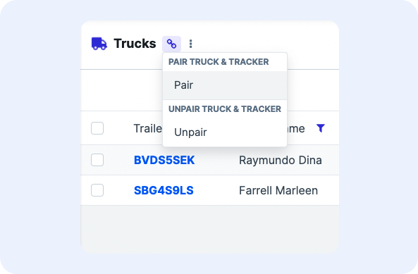
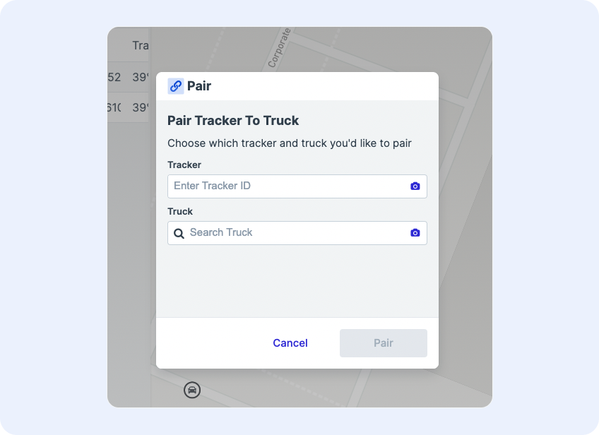
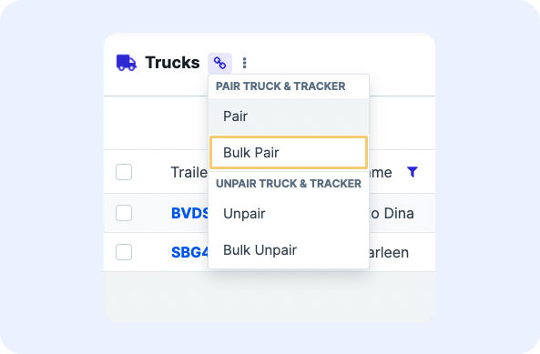
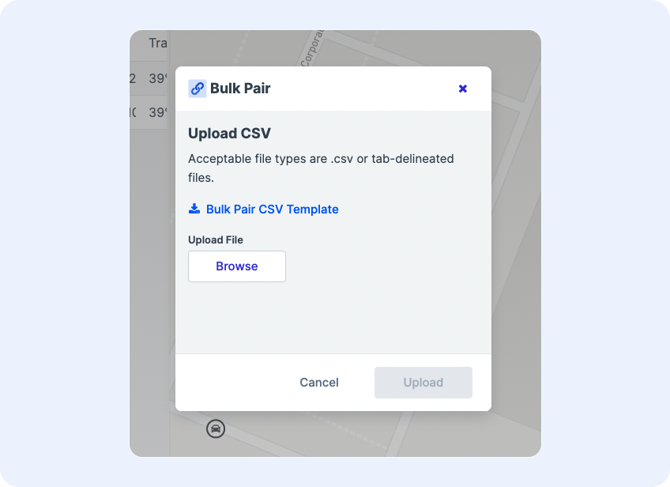

# Pairing

Pairing allows users to associate each of their devices to the assets they are actually tracking. 

For example, a solution may use GPS trackers to monitor positions of a fleet of trucks. The GPS tracker is the device, and the asset is the truck. Pairing associates trackers to trucks, thereby giving business-specific context to each device without having to hard-code business-specific attributes against the device itself.

Enable pairing on the UI to allow users to use scan-based, search-based, and/or bulk pairing of assets and devices from the desktop and mobile views of an application.

## Enabling Pairing

To enable pairing on a project, in Architect add the `pairingEnabled` property to `moltenConfigOptions` within metadata of the system. If the `moltenConfigOptions` doesn't already exist, add the entire JSON in:

``` json hl_lines="3"
{
  "moltenConfigOptions": {
    "pairingEnabled": true
  }
}
```

Then, add one or more of the pairing tags to enable pairing:

1. `is:pairing` - to enable pairing of an asset to a device one at a time 
1. `is:bulkPairing` - to enable pairing of assets to devices in bulk

Apply one or both tags on the relationship attribute on which the pairing will occur. For example, to pair a truck to a tracker, apply tags on the truck blueprint’s tracker attribute.

Lastly, create a network for the assets & network for the devices (if not already created), and apply them to the blueprints. This tells the system which identifiers to look for when the user searches for assets and devices in the pairing popup.

1. In Architect go to the **Device Control > Networks**
1. Click the **+ Custom** button in the upper right to create the device network
1. In the **Create Custom Network** popup, enter: 
    1. A name for the network: can be something like `asset-network-01`
    1. The API Key: can use the same as the name)
    1. The identifiers: the field should match the unique identifier used on the asset (e.g. `assetId`)
1. In the asset blueprint, add the following tag to the blueprint: `network:[asset network name]:[identifier]` (e.g. `network:asset-network01:assetId`)
1. Repeat the steps for a device network and device blueprint, if not already created


## Pairing Assets

### Individual Pairing

Individual pairing is accomplished through using the `is:pairing` tag on the relationship blueprint on which the pairing occurs.

Once added, a link icon should appear to the right of the screen title that when clicked shows the action to pair.

<figure markdown>
{ width="400" }
  <figcaption>Pairing icon with pairing action shown</figcaption>
</figure>

To pair an asset to a device:

1. Select the **Pair** action
1. In the popup, search for the asset in the **Asset** field (or whatever the asset blueprint is named) and select it from the list
    1. Users can also click the camera icon to scan for a barcode using their computer or mobile device's camera. When a barcoe is detected, it will automatically populate in the **Asset** field
1. Search for the device in the **Device** field (or whatever the device blueprint is named) and select it from the list
    1. Users can also click the camera icon to scan for a barcode using their computer or mobile device's camera. When a barcode is detected, it will automatically populate in the **Device** field
1. Click **Pair** and confirm the pairing was succcessful in the confirmation screen

<figure markdown>
{ width="500" }
  <figcaption>Individual pairing screen</figcaption>
</figure>

When you pair, any relevant information, such as the position of the device, will be automatically forwarded to the asset.

!!! Tip "Pre-selecting asset to pair"
    Selecting an asset on the table (by marking its checkbox) before clicking the Pair action will auto-populate the Asset ID in the pairing form. This avoids having users needing to manually type in the asset ID every time.

### Bulk Pairing

Bulk pairing provides users with a CSV template to populate that when uploaded will pair assets to devices en masse. This is particularly helpful for initial system setup or deployments.

Before using bulk pairing, first ensure that the `is:bulkPairing` tag is applied on the relationship blueprint on which the pairing occurs.

Once added, a link icon should appear to the right of the screen title that when clicked shows the action to pair.

<figure markdown>
{ width="400" }
  <figcaption>Pairing icon with bulk pairing action shown</figcaption>
</figure>

To bulk pair:

1. Select the **Bulk Pair** action from the menu
1. In the Bulk Pair screen, click **Bulk Pair CSV Template** to download the CSV template
1. Open the template file in a spreadsheet editor of your choice (Excel, Google Sheets, etc.)
1. In the template there are two columns, one for the asset ID and the other for the device ID. Populate the desired pairings in the sheet. The asset and devices entered in the same row will be paired together
1. Save the file
1. Return to the **Bulk Pair** screen and under **Upload File**, click **Browse**
1. Select the populated template file to upload
1. Wait a few seconds for the pairings to occur
1. Confirm the results in the subsequent screens

<figure markdown>
{ width="500" }
  <figcaption>Bulk pairing screen</figcaption>
</figure>


## Unpairing Assets

### Individual Unpairing

To unpair an individual asset:

1. Click the link icon and select **Unpair**
1. In the **Unpair** screen, search for the the asset ID to unpair
    1. Users can also select the checkmark next to the asset before selecting Unpair to auto-populate the asset ID in the unpairing form.
1. Click **Unpair** and confirm the results in the subsequent screen

### Bulk Unpairing

To unpair assets in bulk:

1. Click the link icon and select **Bulk Unpair**
1. In the Bulk Pair screen, click **Bulk Unpair CSV Template** to download the CSV template
1. In the template there is column for the asset ID. Populate the desired asset IDs to unpair in the sheet
1. Save the file
1. Return to the **Bulk Unpair** screen and under **Upload File**, click **Browse**
1. Select the populated template file to upload
1. Wait a few seconds for the unpairings to occur
1. Confirm the results in the subsequent screens
