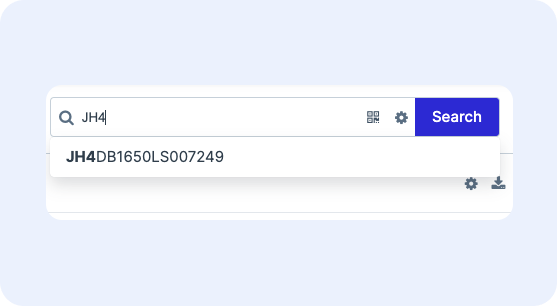
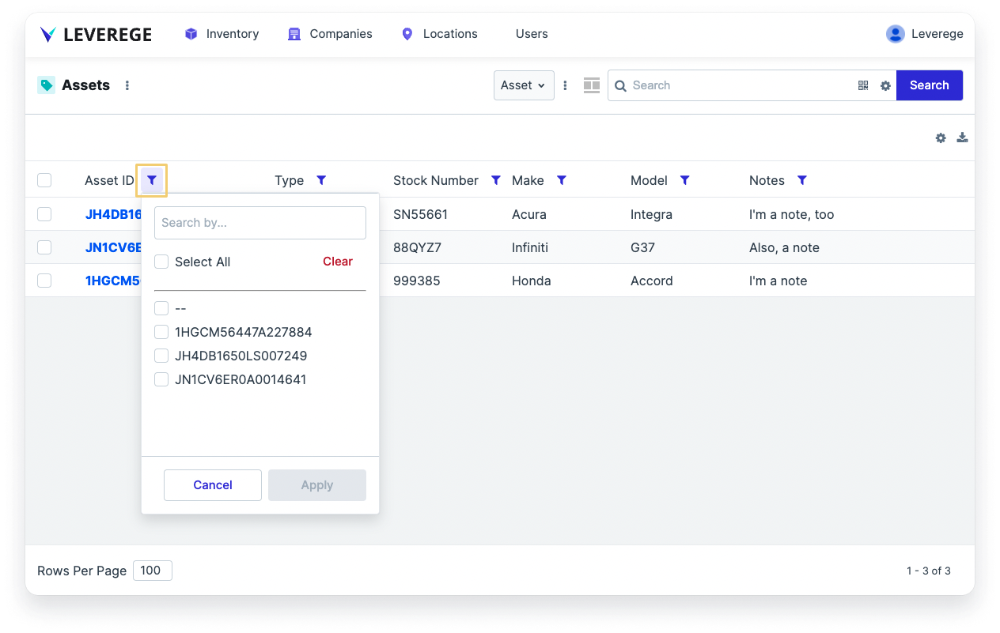
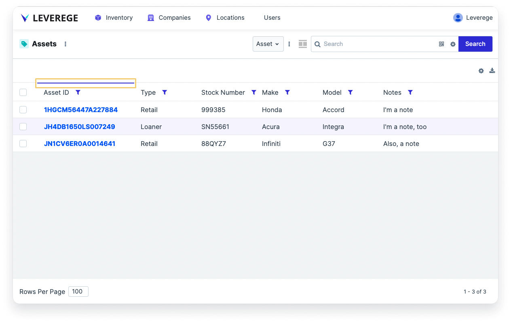

# Search & Filter Overview

The Leverege IoT Stack provides robust capabilities to search and filter your data.

## Searching for Data

Every page of the application contains a search, typically in the upper right of the UI. To search for given item on the screen, begin typing in the search bar.

Suggested matching values will be shown in the dropdown as the user types.

Hit enter to complete the search. The relevant search results will appear in the table, map, or other components that are configured on the page.

<figure markdown>
{ width="450" }
  <figcaption>Example of search result suggestion feature</figcaption>
</figure>

## Filtering and Sorting Data

Each data column in a table viewer can be filtered and sorted.

### Filtering
To filter data, click the filter icon next to the column name. It will open a dropdown that contains the list of possible values. Check one or more those values and then click **Apply** to apply the filter. The results should then be filtered by the selected values.

<figure markdown>
{ width="700" }
  <figcaption>Example of filter dropdown when selecting the filter icon</figcaption>
</figure>

### Sorting
To sort the data, click the column name directly. A colored line should appear above or below the column header to indicate that it's being sorted either ascending or descending. Click the column header again to cycle through the sorting options, which rotates through ascending, descending, or unsorted (default).

<figure markdown>
{ width="700" }
  <figcaption>Example of Asset ID column being sorted descending when clicking column name</figcaption>
</figure>


## Configuring Search

The search bar can be configured so that only certain data fields are searchable. For more information on search configuration, see the documentation on Search in the UI Configuration section.

## Configuring Filters and Sorts

It is possible to set defaults and base components for filtering and sorting for a given page using blueprint metadata. Defaults will apply to your search when no filters/sorts have been added by the user. Bases will always apply in addition to user selected sorts and filters.

To apply sorts and filters, add metadata to the blueprint of the object that you want to apply filters to. In the below example:

* A default filter of `Name = Bessey` will be applied to all cows at the `farm.cows` path. 
* A base filter of `Color = Blue` will be applied to all cows on any cow page (`objectType = cow`). 
* A default sort of `id` by order `asc` will be applied to all cows on cow pages and a base sort of `Name` descending will be applied to all cows at the `field.cows` path. 

Note: You can use the `missing` field of a sort with values of `_first` or `_last` to sort null values to the top or bottom of a list.


``` json
"searchOptions": {
	"filter": {
    	"default": [{
			"filter": {
				"field": "data/name",
				"type": "equals",
				"value": "Bessey"
			},
			"matches": {
				"path": "farm.cows"
			}
		}],
		"base": [{
			"filter": {
				"field": "data/color",
				"type": "equals",
				"value": "Blue"
			},
			"matches": {
				"objectType": "cow"
			}
		}]
	},
	"sort": {
		"default": [{
			"matches": {
				"objectType": "cow"
			},
			"sort": {
				"field": "id",
				"order": "asc"
			}
		}],
		"base": [{
			"matches": {
				"path": "field.cows"

			},
			"sort": {
				"field": "data/name",
				"order": "desc",
				"missing" : "_first"
			}
		}]
	}
}
```