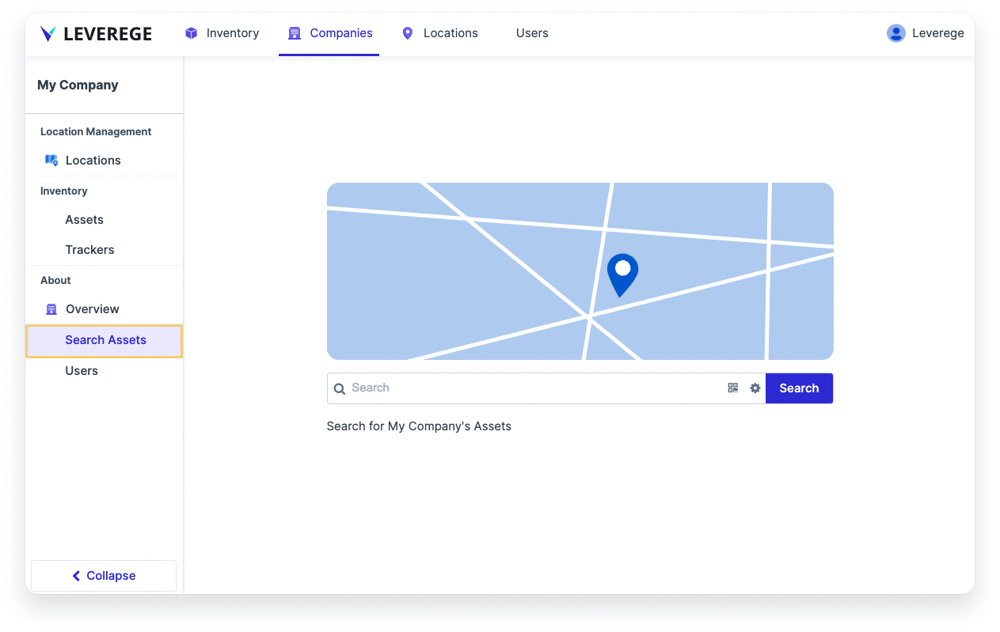

# Quick Search

When you have multiple devices, it’s helpful to use a quick search engine to find a specific device easily. Just like search engines have saved us so much time searching for information, we want to provide users the ability to search for any item within seconds. 

The Leverege IoT Stack offers two types of quick search: 

1. **Root-level search:** Quickly search devices across the entire application
1. **Page-level search:** Quickly search devices within a certain level of the application

## Root Level Search 

Root-level search is helpful to search for all devices of a particular blueprint type across an entire project. To add the root level search:

1. Go to the blueprint named `Asset` and under the **Info** page and add the tag called `<has:simpleSearch>`
1. Once you add this tag, you will see a search assets button appear on the top navigation bar. 

<figure markdown>
{ width="900" }
  <figcaption>Simple search tag added to asset blueprint </figcaption>
</figure>

<figure markdown>
{ width="900" }
  <figcaption>Root-level Search Assets page appears on the top nav bar</figcaption>
</figure>

## Page-Level Search 

Page-level search is helpful in quickly searching within a specific level of the application. For example, to search all assets in a given company, add the tag `<has:simpleSearch>` to the `company.assets` attribute in the `Company` blueprint.

<figure markdown>
{ width="900" }
  <figcaption>Add page-level quick search in blueprint attribute </figcaption>
</figure>

<figure markdown>
{ width="900" }
  <figcaption>Page-level search appears on the side navigation bar </figcaption>
</figure>

!!! warning "Adding simple search to attributes"
    It’s important to note that you can only apply page-level searches to attributes representing other blueprints. 
    
    For instance, within the company blueprint below, you can add the quick search tag to the following attributes: locations, assets, and trackers because these are relationship attributes referencing other blueprints. 
    
    You cannot add page-level quick search to regular data attributes that don’t have their own blueprints (e.g., email, phone, name, and contact)

## Configuring Simple Search Results

To configure which fields are included in a quick search, click the gear icon in the search bar. Configuration behaves in the same way as the main Search configuration. 

<figure markdown>
{ width="900" }
  <figcaption>Configuring searchable fields in Quick Search</figcaption>
</figure>

Executing a simple search will bring users to a dedicated simple search results page. This page must be configured as any other UI page by setting the layout and configuring each component. Refer to the previous documentation on the layout controller and the other UI components for how to configure this in more detail.

## Configuring the Look & Feel of Quick Search

Other tags and metadata can be added to change the look of the quick search page.

* If configuring a **root-level** quick search page, the tags and metadata are added on the blueprint
* If configuring a **page-level** quick search page, the tags and metadata are added on the attribute

### Simple Search Tags

| Tag      | Description                          |
| ----------- | ------------------------------------ |
| `simpleSearchLinkName:<name>`       | Set the name of the quick search page in the nav bar |
| `simpleSearchScreenTitle:<title> `       | Set the name of the quick search page in the search results page header |
| `simpleSearchNavSort:<SortKey>`    | Set the sort key that determines where the quick search appears in the nav ordering |
| `simpleSearchExcludeFrom:<ROLE>` |  Set which role cannot not see quick search |
| `simpleSearch:preferredView` | Set the quick search to be the default redirect page |

### Simple Search Metadata

| Tag      | Description                          |
| ----------- | ------------------------------------ |
| `strings/simpleSearchHint`       | Set the text on the search hint that appears below the search bar |
| `icons/simpleSearchScreenIcon`       | Set the screen icon on the simple search page |
| `icons/simpleSearchNavIcon`    |  Set the nav icon on the simple search page |
| ` icons/simpleSearchDoodle ` |  Set the doodle artwork above the search bar |

