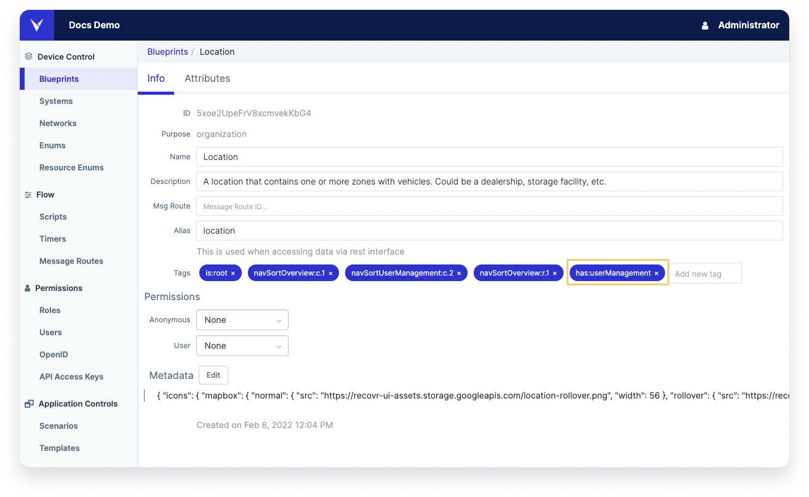
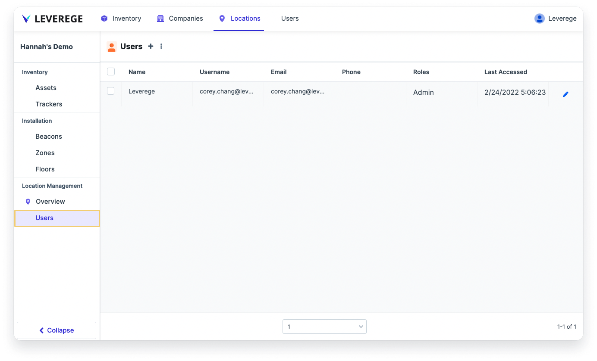
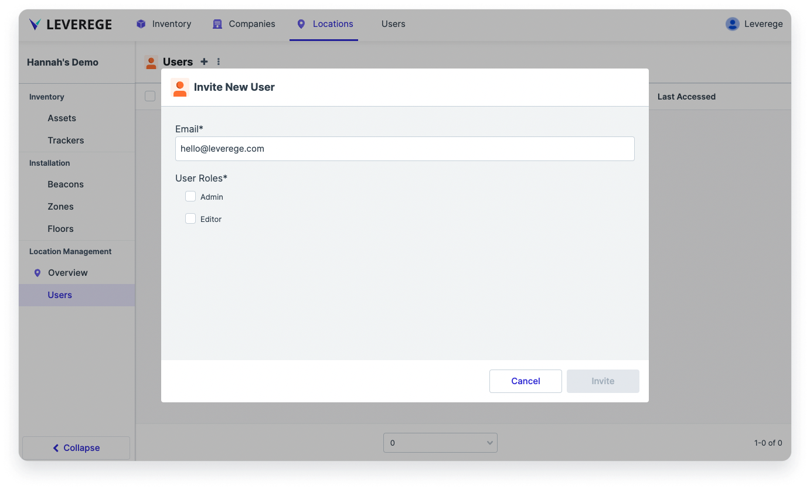
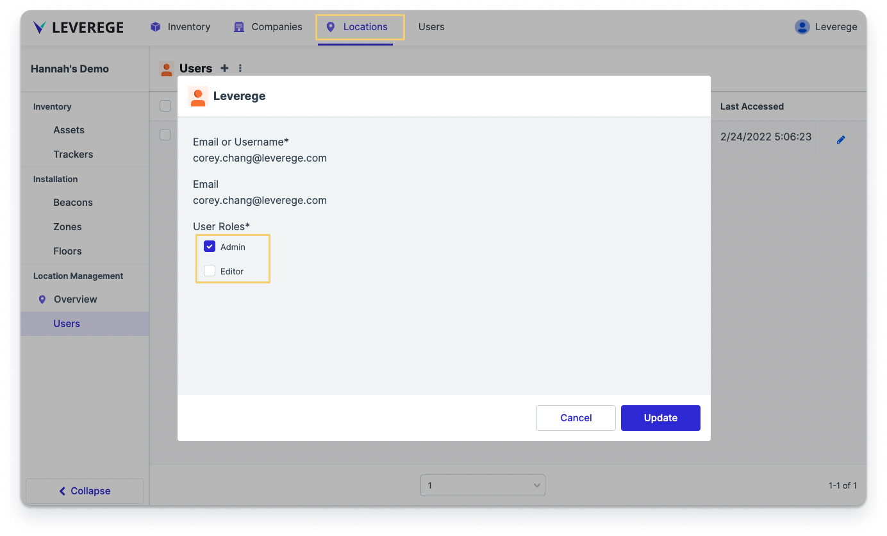
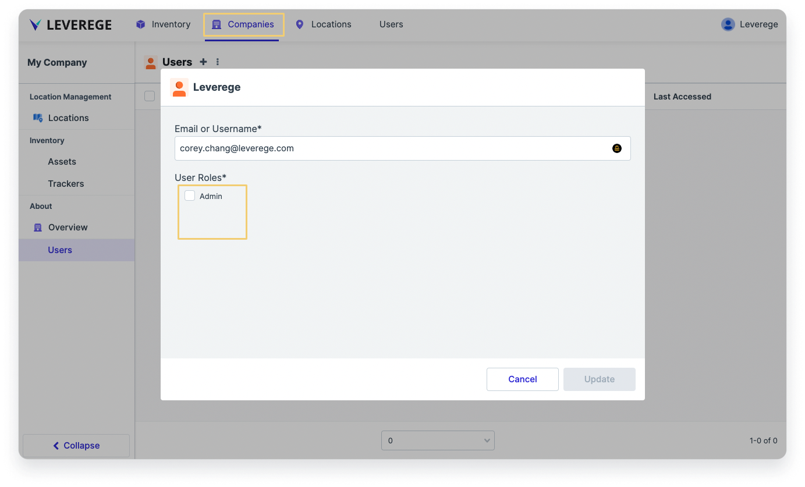

# User Management

The Leverege IoT stack offers a powerful set of user management capabilities. Using role-based access control (RBAC), application administrators can add user management to any level of their organizational hierarchy and assign one or more roles to their users.

This documentation focuses on enabling the user management function and managing users within applications built using the Leverege Stack. For information on how user roles and permissions are configured, see the documentation on user roles and permissions.

## Adding a User Management Interface to a Page

Users can add a user management interface (the same one seen on API UI) on specific pages of the UI by adding in the `has:userManagement` tag onto the blueprint corresponding to the page. For example, to add a user management tab onto the Locations page, enter in the tag has:userManagement on the Location blueprint. 

<figure markdown>
{ width="900" }
  <figcaption>User management tag applied to blueprint</figcaption>
</figure>

<figure markdown>
{ width="900" }
  <figcaption>Resulting user management page from adding user management tag</figcaption>
</figure>

## Adding Users to a Page

To add users to a given part of the system, administrators can either go to:

* The user management page at the relevant page/level of the application itself, provided that the User Management page has been added using the `has:userManagement` tag as described in the previous section, OR

<figure markdown>
{ width="900" }
  <figcaption>Adding a user to a specific location using the UI-embedded user management page</figcaption>
</figure>

* The **Access** page in Architect of the System or specific Device to which the user should have access.

<figure markdown>
{ width="900" }
  <figcaption>Adding a user to a specific location using the location's Access page in Architect</figcaption>
</figure>


In either case, the process for adding a user to the page is the same:

1. Click the **+ Button** at the top of the page to open the **Add Users** page
1. Enter the email address of the user to add, and press **Enter**
1. If the user is new, select either **Invite New User** or **Create New User Account**. If the user already exists, then skip this step.
    1. If selecting **Invite New User**, the system will provide a prompt to select the roles from the system. Once the roles have been selected, click **Invite**. This will send an automated invitation email to the user, which will contain a link for them to activate their account and enter in the remaining account details and set their password.
    1. If selecting **Create New User Account**, the system will provide a prompt enter in the necessary account information and select the roles to assign the user. Once the roles have been selected, click **Create**. This will send an automated invitation email to the user, which will contain a link for them to activate their account and log in.

## Editing and Removing Users from a Page

To edit a user's roles, click the pencil icon to the right of their row. Edit the roles in the popup that appears.

To remove a user access from a page, mark the checkbox on the left next to their username. Then select the three-dots icon next to Users in the header > **Remove User**. This removes the user access from the page, but does not delete the user entirely from the system. To delete a user entirely from the system, see the following section.

## Deleting Users

To completely delete a user from the system, in Architect go to the **Users** page. Find the user to delete and click the gear icon on the right side of the row and select **Delete**.


## Hiding a User Management Interface from Certain Roles

To hide the user management interface added on a blueprint page from certain roles, use the `excludeUserManagementFrom:[roleName]` tag, replacing `roleName` with the desired role name to exclude.

## Setting The Selectable Roles In User Management UI

To set which roles appear on which pages of the UI:

1. Go to the **Permissions > Roles** page and select the role to configure
1. In the panel on the right, click on the **Edit** button next to the **Metadata** section to open up the dialog box
1. Add a property called `usedAtBlueprints` and enter an array of the blueprint name(s) of the pages for which that role can be selected. The blueprint name should match the alias field in the blueprint configuration. In the example below, the metadata shown is for the Editor role and shows that it is selectable only in a Locations page. The alias of the blueprint is `location`. 

The following two screenshots below the metadata show that the role is selectable in the Locations page, but not selectable in other places in the UI (e.g. the Company page).

``` json hl_lines="10 11"
{
  "ui": {
    "defaultUrl": {
      "type": "urlPathRoleCalculator",
      "single": "/p/editor/location/:resourceId",
      "multiple": "/p/editor/location",
      "resourceType": "5xoe2UpeFrV8xcmvekKbG4"
    }
  },
  "usedAtBlueprints": [
    "location"
  ],
  "priority": 1
}
```

<figure markdown>
{ width="900" }
  <figcaption>Editor role showing on the location page</figcaption>
</figure>

<figure markdown>
{ width="900" }
  <figcaption>Editor role correctly hidden from the company page</figcaption>
</figure>


