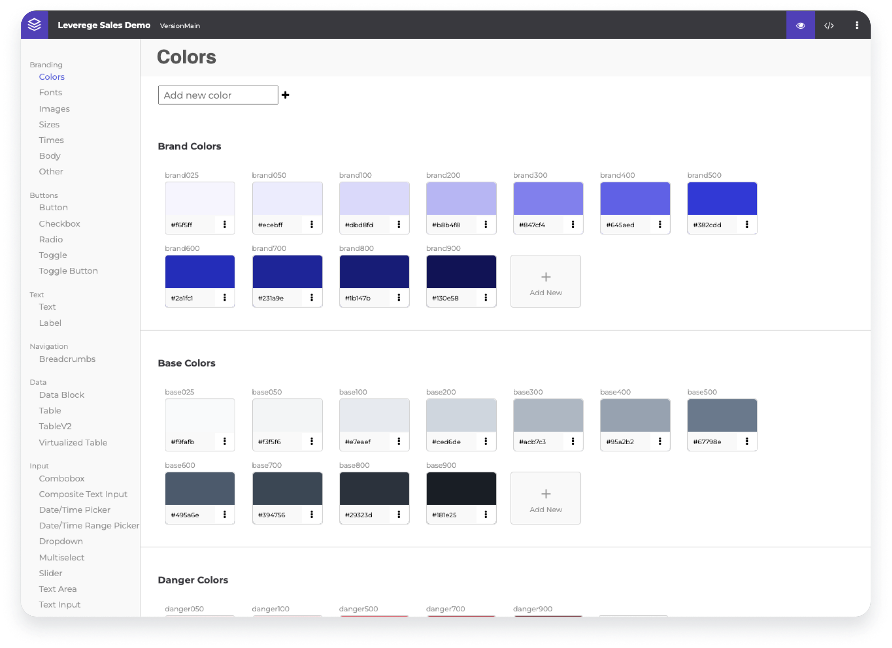
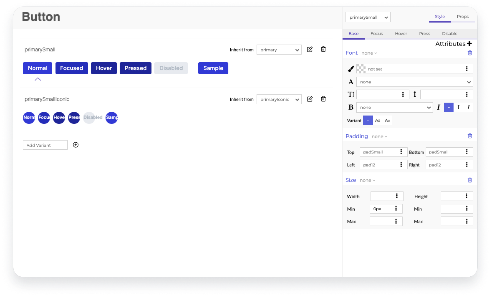
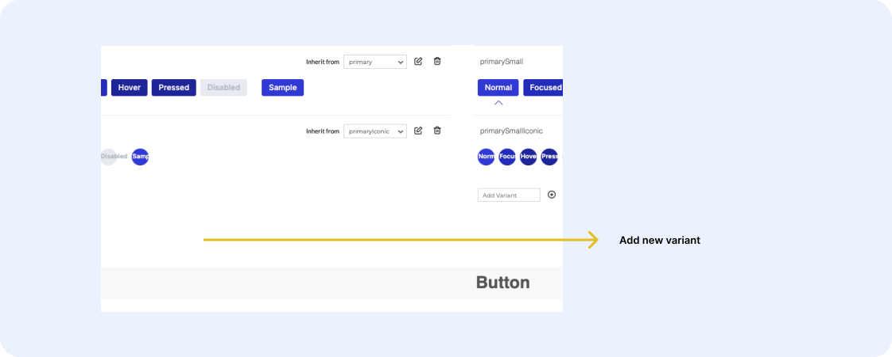
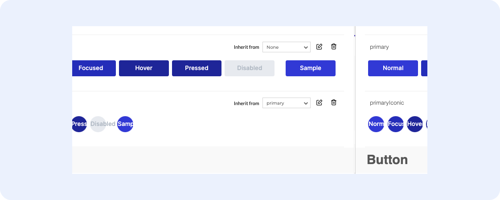

# UI Builder Overview

The UI Builder is an application that empowers users with the ability to style UI elements and make visual changes to UI elements in-real time. 

UI Builder is aimed at designers and other non-technical users to be able to make UI style changes quickly. By making UI style changes through UI Builder, users do not need to know how to code, manipulate HTML/CSS, or redeploy a project. Designers can make styling changes independently of engineers building out the application. This reduces the need to ask engineers to make styling changes and shortens the communication loop.

!!! Info "Active Themes"
    Active themes should only be used on dev environments. In your staging and production environments, engineers will export the theme during the deployment so that it is "static". This ensures that designers do not accidentally turn an entire production interface pink, for example.
    
## Navigating the UI Builder

Every project has it's own UI builder project associated with it. If a given project has multiple UIs, the same UI builder project or multiple UI builder projects can be used per UI. 

UI Builder projects are organized by the type of UI element you are editing. You can find the categories down the left side of the project. 

<figure markdown>
{ width="700" }
  <figcaption>UI Builder Project</figcaption>
</figure>

When a user clicks into a specific UI element, they can visually see an example of the UI element and can manually update nearly every aspect of it (e.g. color, padding, borders, hover states etc.). Any changes they make to the element are live changes to the development UI.

<figure markdown>
{ width="700" }
  <figcaption>UI Builder Element Editor</figcaption>
</figure>

## Variants

Each UI type has variations of that element called variants. A variant is a way to reuse the style of a given element in multiple places. 

For example, if a designer wants to use the same style button on two different places in the UI, they would use the same variant and any changes made to that variant on UI Builder will update both of those buttons. 

This means that all the designer has to do is specify to the engineer that a given button should inherit a given variant. It also means the engineer can code/place the button and the designer can then use the UI builder to fine tune how it looks. For some components, the variant can be specified in configuration panel of the UI component itself rather than needing to communicate it to the engineer.

### Creating a New Variant

Create a variant by clicking the type of UI element in the left navigation. Then scroll to the bottom of the page and enter in the name of the variant in Variant field and press the + button. Configure the variant in the resulting right hand panel.

<figure markdown>
{ width="700" }
  <figcaption>Adding a new variant</figcaption>
</figure>

### Variant Inheritance

When creating a new variant, you very rarely need to start from scratch. Let's say you already built your primary button, but now you just need an icon version. Instead of rebuilding all of your styles, you can set your new primaryIconic button to inherit all of the default values from the primary button. Once you set that up, you can add in any overrides you need, maybe the width or border-radius for example. 

<figure markdown>
{ width="700" }
  <figcaption>Adding a new variant</figcaption>
</figure>

