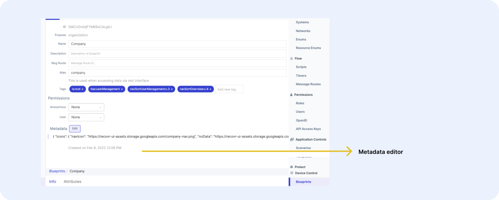
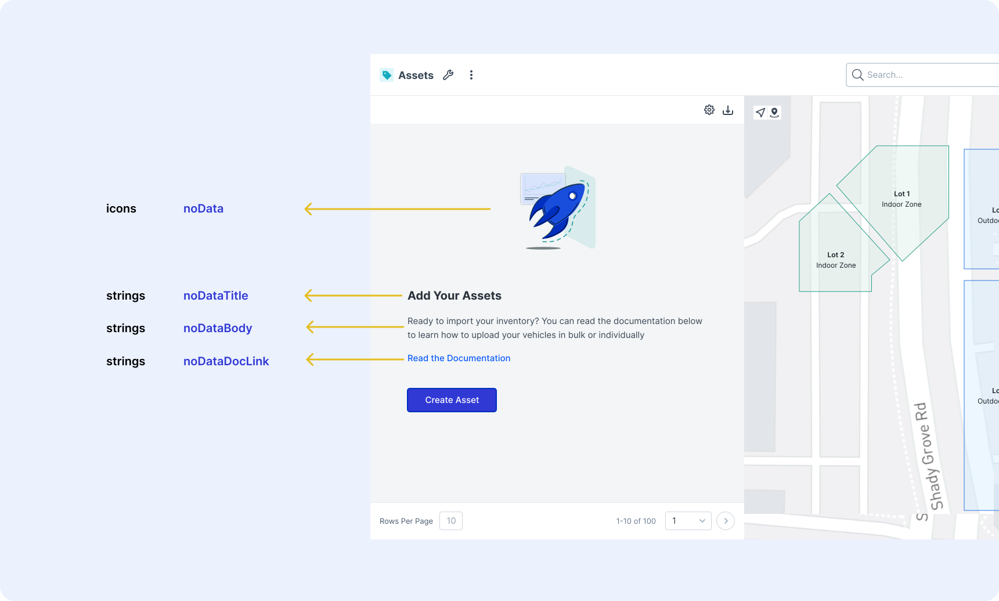
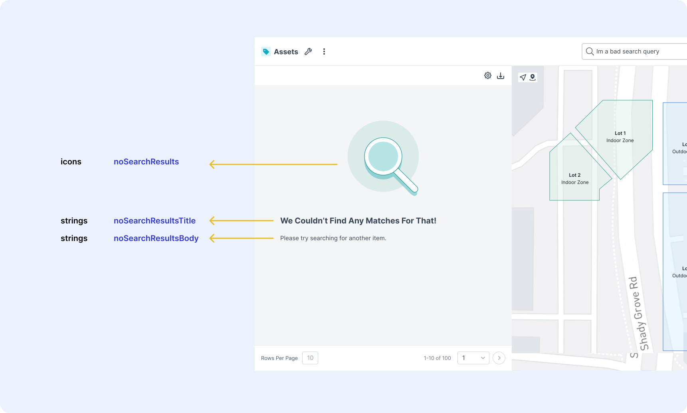

# Empty States & Illustrations

No one likes a blank screen. That's why we've given you the ability to add helpful text hints, illustrations, and help links to the different empty states users might come across in the UI.

<figure markdown>
{ width="700" }
  <figcaption>Edit blueprint metadata in the info tab</figcaption>
</figure>

## No Data to Load

When your users are just starting out with your UI and they haven't added any data yet, they may need some help to guide them in the right direction. That's why we've given you the ability to configure the empty states of certain components, like the table & card list. You can make these changes for a given blueprint in the blueprint's metadata.

<figure markdown>
{ width="700" }
  <figcaption>Configuration options</figcaption>
</figure>

Metadata Example

```json
{
 "strings": {
        "noDataTitle": "Add Your Assets",
        "noDataBody": "Ready to import your asset inventory? Upload your assets in bulk or individually.",
        "noDataDocLink": "https://www.google.com/"
        },
  "icons": {
        "noData": "https://molten-ui-assets.storage.googleapis.com/no-data.svg"
        }
}
```

  
## No Search Results

Sometimes your user searches for something that just doesn't exist. To help them along the way, and account for any special search and filter behaviors you might have in your application, you can customize your empty search results table & list message per blueprint. 

<figure markdown>
{ width="700" }
  <figcaption>Configuration options</figcaption>
</figure>

Metadata Example 

  ```json
  {
   "strings": {
         "noSearchResultsTitle": "We Couldn't Find Any Matches For That",
         "noSearchResultsBody": "Please try another search query.",
         },
   "icons": {
         "noSearchResults": "https://molten-ui-assets.storage.googleapis.com/no-search-results.svg"
         }
  }
  ```


!!! Tip "SVG files will have the best resolution"
