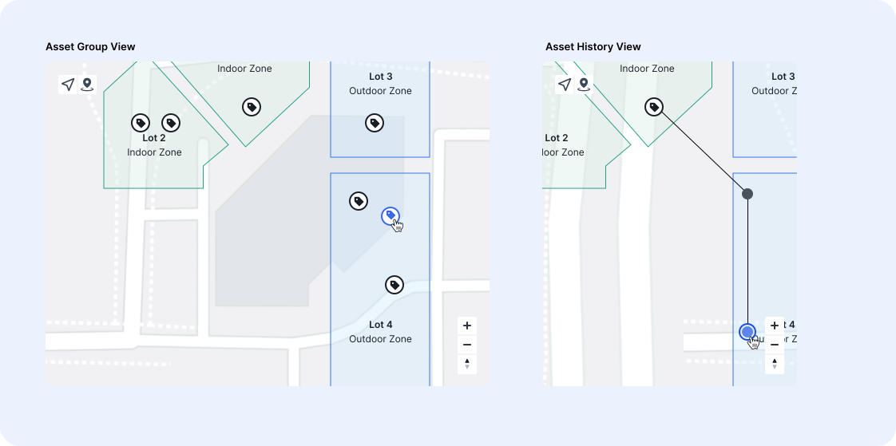
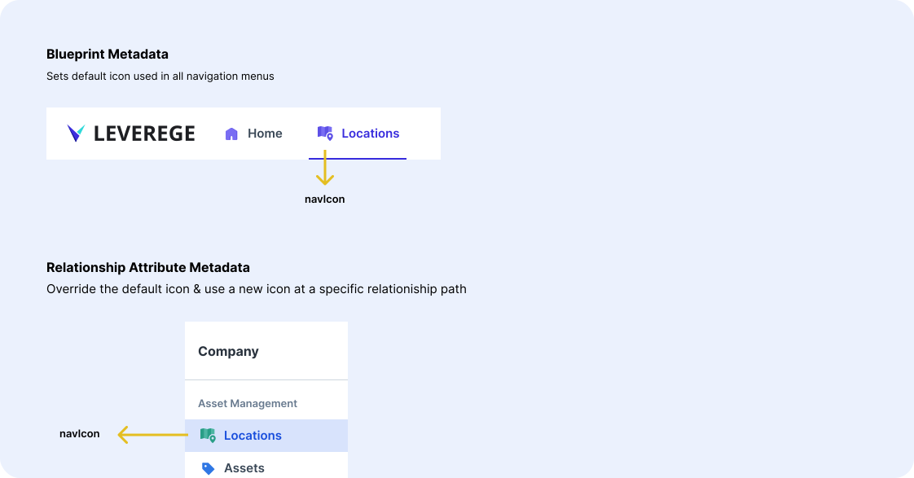

# Icon Configuration

There are many situations where you will want to customize your icons, whether they are for your navigation, map, headers, or lists. This is easily accomplished by adding metadata via Architect. Before following along, please ensure you have access to our Architect UI.

<figure markdown>
{ width="700" }
  <figcaption>Edit blueprint metadata in the info tab</figcaption>
</figure>

!!! Tip "Storing Icons"
    Prior to any of this configuration, the icons must be uploaded to the cloud and hosted publically. We suggest using GCP for this step. You also must know the URL of each icon state.

## Map Icons

The metadata for map icons are found under the mapbox property, which is further subdivided by the icon state. Supported icon types for the map include your default icons (normal, rollover, selected, rollover-selected) and your historical point icons (history, history-rollover, history-selected).

!!! Info "Format: PNG"

### Current Location Icon States
<figure markdown>
{ width="700" }
  <figcaption>Possible icon states for the current location of a device on the map</figcaption>
</figure>

### History Location Icon States
<figure markdown>
{ width="700" }
  <figcaption>Possible icon states for a historical point of a device on the map</figcaption>
</figure>

### Map Examples
<figure markdown>
{ width="700" }
  <figcaption>Example of icons used in map context</figcaption>
</figure>


###Metadata Example

Icon State Fields

| Field | Definition |
|-------|---------|
| `src` | The URL of the icon |
| `height` | Height of the icon (px) |
| `width` | Width of the icon (px) |


```json
{
"icons": {
  "mapbox": {
    "history": {
      "height": 48,
      "src": "https://molten-ui-assets.storage.googleapis.com/history.png",
      "width": 48
    },
    "history-rollover": {
      "height": 48,
      "src": "https://molten-ui-assets.storage.googleapis.com/history-rollover.png",
      "width": 48
    },
    "history-selected": {
      "height": 48,
      "src": "https://molten-ui-assets.storage.googleapis.com/history-selected.png",
      "width": 48
    },
    "normal": {
      "height": 53,
      "src": "https://molten-ui-assets.storage.googleapis.com/asset-normal.png",
      "width": 53
    },
    "rollover": {
      "height": 80,
      "src": "https://molten-ui-assets.storage.googleapis.com/asset-rollover.png",
      "width": 80
    },
    "rollover-selected": {
      "height": 80,
      "src": "https://molten-ui-assets.storage.googleapis.com/asset-rollover-selected.png",
      "width": 80
    },
    "selected": {
      "height": 80,
      "src": "https://molten-ui-assets.storage.googleapis.com/asset-selected.png",
      "width": 80
    }
  }
```

| Property | Image Naming Convention |
|-------|---------|
| `normal` | blueprint-normal.png |
| `rollover` | blueprint-rollover.png |
| `selected` | blueprint-selected.png |
| `rollover-selected` | blueprint-rollover-selected.png |
| `history` | Global Icon: history.png, Blueprint-Specific Icon: blueprint-history.png |
| `history-rollover` | Global Icon: history-rollover.png, Blueprint-Specific Icon: blueprint-history-rollover.png |
| `history-selected` | Global Icon: history-selected.png, Blueprint-Specific Icon: blueprint-history-selected.png|

## Navigation Icons

The `navIcon` property is used in the top navigation bar and the sidebar, as well as the mobile navigation menu. You can set the default icon in the blueprint metadata.

!!! Info "Format: SVG or PNG"

<figure markdown>
{ width="700" }
<figcaption>Icon usage in navigation</figcaption>
</figure>
  
### Metadata Example
  
  ```json
  {
    "icons": {
      "navIcon": "https://molten-ui-assets.storage.googleapis.com/asset-nav.svg"
    }
  }
  ```
  
  | Property | Image Naming Convention |
  |-------|---------|
  | `navIcon` | blueprint-nav.svg |

  

## Title Icons
  
The  `screenIcon` property is used in the header section of a given page. You can set the default icon in the blueprint metadata.

!!! Info "Format: SVG or PNG"

<figure markdown>
{ width="700" }
  <figcaption>Icon usage in screen titles</figcaption>
</figure>

### Metadata Example

```json
{
  "icons": {
    "screenIcon": "https://molten-ui-assets.storage.googleapis.com/asset-title.svg"
  }
}
```

| Property | Image Naming Convention |
|-------|---------|
| `screenIcon` | blueprint-title.svg |

## Type Icons

The `typeIcon` property is used in list cards, selection cards, and more. You can set the default icon in the blueprint metadata.

!!! Info "Format: SVG or PNG"

### Metadata Example

```json
{
  "icons": {
    "typeIcon": "https://molten-ui-assets.storage.googleapis.com/asset-normal.png"
  }
}
```
For screen icons, some people prefer to use the same icon they used for the `normal` map property. If so, you will use the same file with the naming convention blueprint-normal.png. If you want to use a seperate file, follow the naming convention below.

| Property | Image Naming Convention |
|-------|---------|
| `typeIcon` | blueprint-type.svg |


