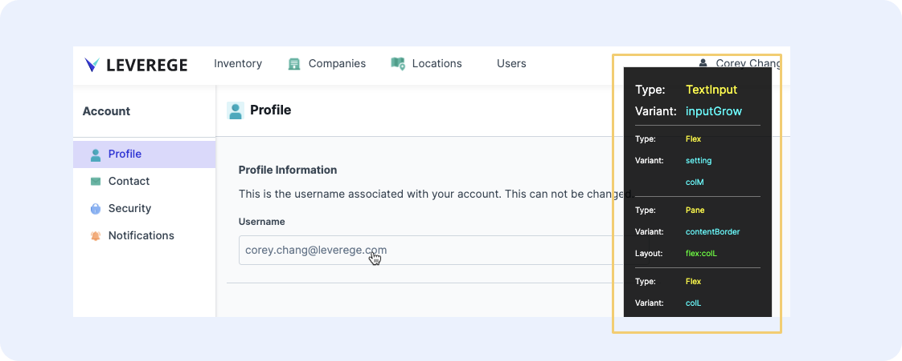

# UI Inspector Overview

!!! Tip "Enabling the Inspector"
    The UI Inspector should only be enabled in your development environment. Engineers can enable the inspector per UI. Once the inspector is enabled, you can toggle it on and off using the keyboard shortcut `Ctrl`+`i`

The UI Inspector allows designers to hover over any UI element in the interface and quickly see the element type and variant name. Because every element is nested in another, the inspector will show the child, then each consecutive parent in the panel. If the element in question is a pane, the inspector will include the layout as well.

<figure markdown>
{ width="700" }
  <figcaption>Inspector</figcaption>
</figure>

