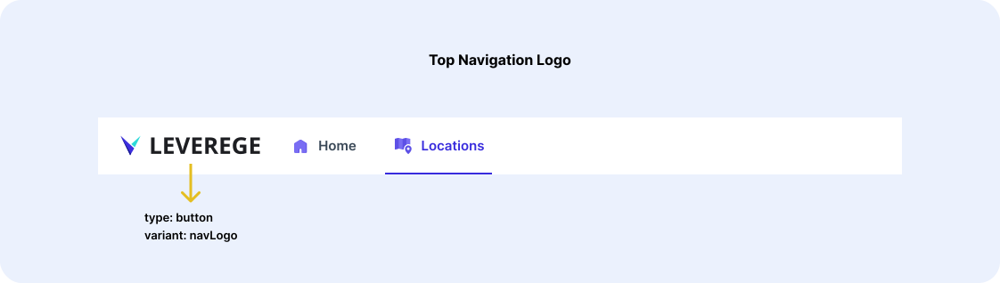
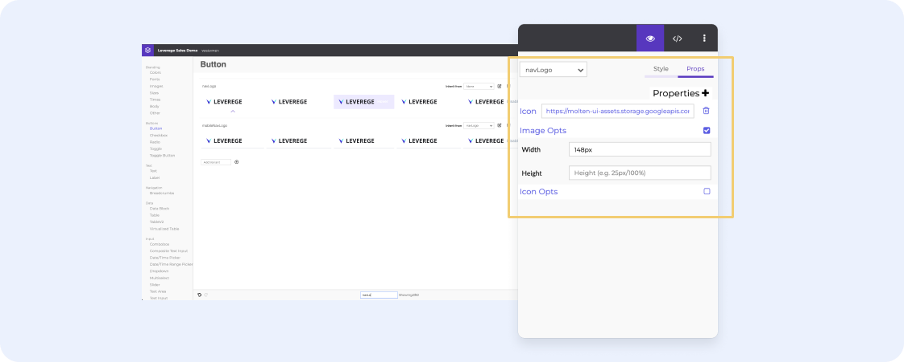
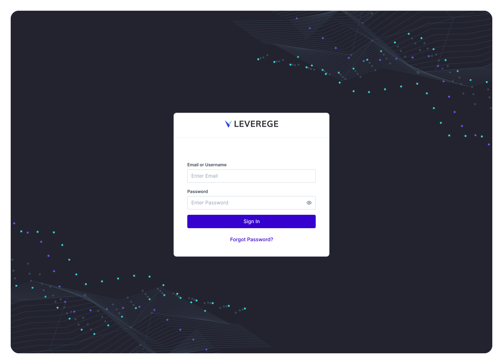
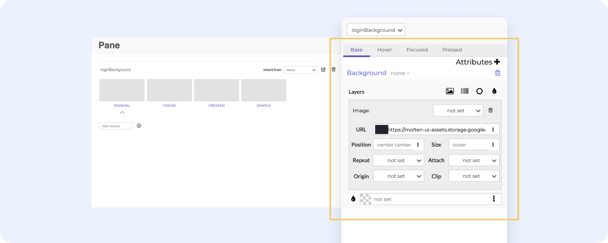

# Updating Logos & Images

The logos used in the interfaces are stored in the UI builder in various places. Below, we will show you where each logo is located so that you can update them anytime. 

!!! Tip "Logo Storage"
    The UI Builder does not store any files. Before you begin, please host your logos publically on the web. We suggest using GCP for this step.
    
## Top Navigation Logo

<figure markdown>
{ width="700" }
  <figcaption>Top Navigation Logo</figcaption>
</figure>

- Element Type: Button
- Variant Name: `navLogo`
- Mobile Override: `mobileNavLogo`

!!! Tip "SVG Format for Best Resolution"

Once you have located the variant, select the variant and navigate to the right hand panel. There, you will select the property tab and paste your URL. 

<figure markdown>
{ width="700" }
  <figcaption>Paste URL into icon property field</figcaption>
</figure>

## Login Page Options

<figure markdown>
{ width="700" }
  <figcaption>Login Page</figcaption>
</figure>

There are two branding assets that can be configured on this page.

- Company logo
- Background image (behind the white box)

### Login Logo

The login logo is a different element & variant in the UI builder than the navLogo. The variant information is below. 

- Element Type: Text
- Variant Name: `loginLogo`

Edit the logo by navigating to the property tab and pasting the URL (same process as above)

### Login Background

The login background is a pane and the image will be added as the URL of the background property.

- Element Type: Pane
- Variant Name: `loginBackground`

<figure markdown>
{ width="700" }
  <figcaption>Paste URL into background image field</figcaption>
</figure>
