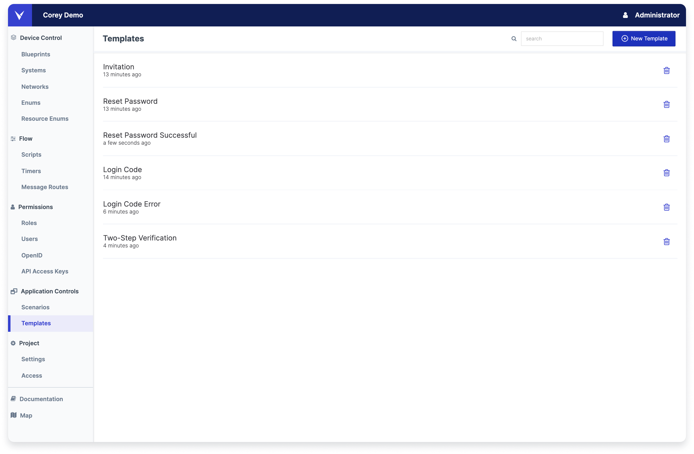
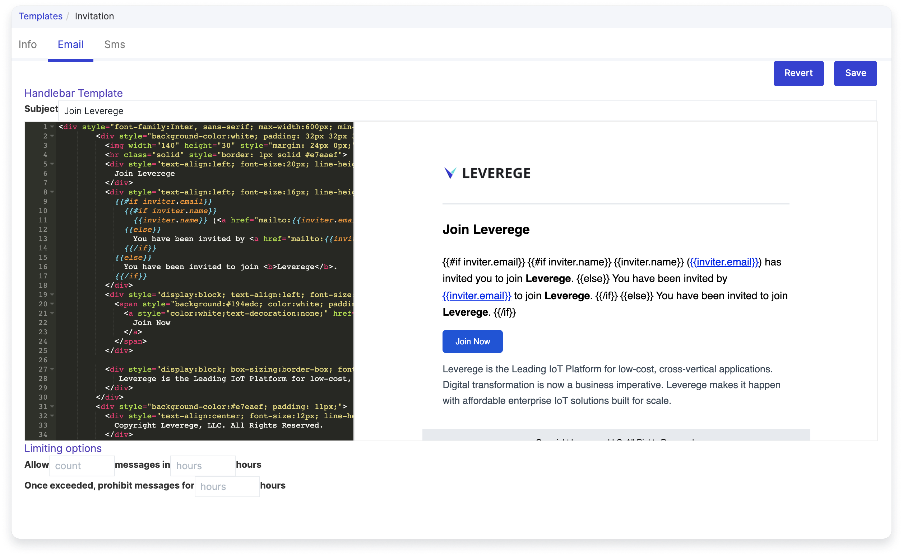

# Email & SMS Templates

We provide multiple email templates out of the box in Architect. Any email template can be customized using our html editor. Below, we'll walk through how you can easily create and customize your emails.

!!! Tip "Adding a Template"
    Our available templates are all easy to add under the New Template button in the top right corner

<figure markdown>
{ width="700" }
  <figcaption>Templates in Architect</figcaption>
</figure>

## Available Templates

| Name | Alias |  Purpose |
|-------|-------|-------------|
| Invitation | activateAccount | When a user is invited to the system, they will receive this email invitation |
| Reset Password | resetPassword | When a user selects forgot password via the login screen, they will receive this email |
| Reset Password Successful | resetPasswordSuccess | After a user resets their password, they will receive a confirmation email |
| Profile Changed | profileChanged | If a user changes any of their profile information, they will receive a confirmation email |
| Login Code | loginCode | If a user requests a one-time access code via email, they will receive this email with the requested code |
| Two-Step Verification| twoFactorCode | If a user enables two-step verification with their email, when they try to sign in they will receive this email as the second step in the process |
| Login Code Error | loginCodeError | Users can not request one-time access codes with the same email that has two-step verification enabled. If they try to request a code, they will receive this email |

### Editing Your Template

When you select a template, you will see three tabs. Make sure you save any changes you make in the top right corner.

!!! Warning "Do not change the alias of a template"

Tabs Overview

- Info: Contains the name of the template and the `alias`. Editing the `alias` will break the template.
- Email: Most of the offered templates are email-only. Under the email tab, you will see a handlebar editor where you can edit the email and an email subject text field. 
- Text: If the template has a supported SMS component, you will see the text message under the text tab.

<figure markdown>
{ width="700" }
  <figcaption>Email template editor</figcaption>
</figure>

### Supported SMS Templates

The following templates also support SMS versions. 

| Name | Alias |  Purpose |
|-------|-------|-------------|
| Login Code | loginCode | If a user requests a one-time access code via text, they will receive this text with the requested code |
| Two-Step Verification| twoFactorCode | If a user enables two-step verification with their phone number, when they try to sign in they will receive this text message as the second step in the process |
| Login Code Error | loginCodeError | Users can not request one-time access codes with the same phone number that has two-step verification enabled. If they try to request a code, they will receive this text |


## Configuring Your Template's Buttons

Some email templates include a button that takes you to a given UI. Once you have your UI stood up on the desired URL, you can edit the URL information in a given button to ensure it takes you to the right place.

``` html 
<span style="background:#194edc; color:white; padding:10px 20px; border-radius:5px; font-size: 13px;">
  <a style="color:white;text-decoration:none;" href="https://yourURLhere/activateAccount?username={{username}}&email={{email}}&token={{activationToken}}{{#if projectId}}&projectId={{projectId}}{{/if}}">
    Join Now
  </a>
</span>
```
