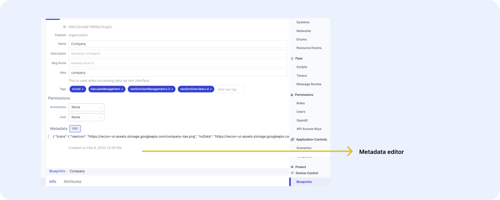
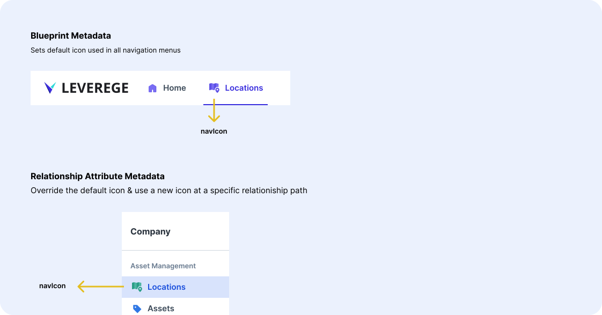
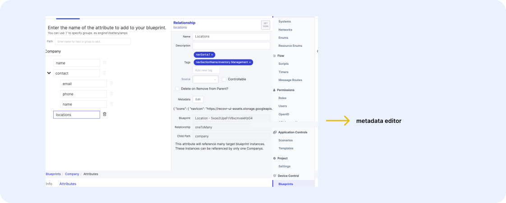

# Icon Configuration

There are many situations where you will want to customize your icons, whether they are for your navigation, map, headers, or lists. This is easily accomplished by adding metadata via Architect. Before following along, please ensure you have access to our Architect UI.

<figure markdown>
{ width="700" }
  <figcaption>Edit blueprint metadata in the info tab</figcaption>
</figure>


!!! Tip "Storing Icons"
    Prior to any of this configuration, the icons must be uploaded to the cloud and hosted publically. We suggest using GCP for this step. You also must know the URL of each icon state.

## Map Icons

The metadata for map icons are found under the mapbox property, which is further subdivided by the icon state. Supported icon types for the map include your default icons (normal, rollover, selected, rollover-selected) and your historical point icons (history, history-rollover, history-selected).

!!! Info "Format: PNG"

### Current Location Icon States
<figure markdown>
{ width="700" }
  <figcaption>Possible icon states for the current location of a device on the map</figcaption>
</figure>

### History Location Icon States
<figure markdown>
{ width="700" }
  <figcaption>Possible icon states for a historical point of a device on the map</figcaption>
</figure>

### Map Examples
<figure markdown>
{ width="700" }
  <figcaption>Example of icons used in map context</figcaption>
</figure>


###Metadata Example

Icon State Fields

| Field | Definition |
|-------|---------|
| `src` | The URL of the icon |
| `height` | Height of the icon (px) |
| `width` | Width of the icon (px) |


```json
{
"icons": {
  "mapbox": {
    "history": {
      "height": 48,
      "src": "https://molten-ui-assets.storage.googleapis.com/history.png",
      "width": 48
    },
    "history-rollover": {
      "height": 48,
      "src": "https://molten-ui-assets.storage.googleapis.com/history-rollover.png",
      "width": 48
    },
    "history-selected": {
      "height": 48,
      "src": "https://molten-ui-assets.storage.googleapis.com/history-selected.png",
      "width": 48
    },
    "normal": {
      "height": 53,
      "src": "https://molten-ui-assets.storage.googleapis.com/asset-normal.png",
      "width": 53
    },
    "rollover": {
      "height": 80,
      "src": "https://molten-ui-assets.storage.googleapis.com/asset-rollover.png",
      "width": 80
    },
    "rollover-selected": {
      "height": 80,
      "src": "https://molten-ui-assets.storage.googleapis.com/asset-rollover-selected.png",
      "width": 80
    },
    "selected": {
      "height": 80,
      "src": "https://molten-ui-assets.storage.googleapis.com/asset-selected.png",
      "width": 80
    }
  }
```


## Navigation Icons

The `navIcon` property is used in the top navigation bar and the sidebar, as well as the mobile navigation menu. You can set the default icon in the blueprint metadata.

!!! Info "Format: SVG or PNG"

<figure markdown>
{ width="700" }
<figcaption>Icon usage in navigation</figcaption>
</figure>
  
### Metadata Example
  
  ```json
  {
    "icons": {
      "navIcon": "https://molten-ui-assets.storage.googleapis.com/asset-nav.svg"
    }
  }
  ```

## Title Icons
  
The  `screenIcon` property is used in the header section of a given page. You can set the default icon in the blueprint metadata.

!!! Info "Format: SVG or PNG"

<figure markdown>
{ width="700" }
  <figcaption>Icon usage in screen titles</figcaption>
</figure>

### Metadata Example

```json
{
  "icons": {
    "screenIcon": "https://molten-ui-assets.storage.googleapis.com/asset-title.svg"
  }
}
```

## Type Icons

The `typeIcon` property is used in list cards, selection cards, and more. You can set the default icon in the blueprint metadata.

!!! Info "Format: SVG or PNG"

### Metadata Example

```json
{
  "icons": {
    "typeIcon": "https://molten-ui-assets.storage.googleapis.com/asset-normal.png"
  }
}
```

## Attribute Overrides

To override the default icon at a specific relationship path, add the icon property to the metadata of the relationship attribute. For example, to override the location `navicon` at the company level, you’ll go to the company blueprint’s location attribute and add the metadata.

<figure markdown>
{ width="700" }
  <figcaption>Override metadata at the relationship attribute</figcaption>
</figure>

