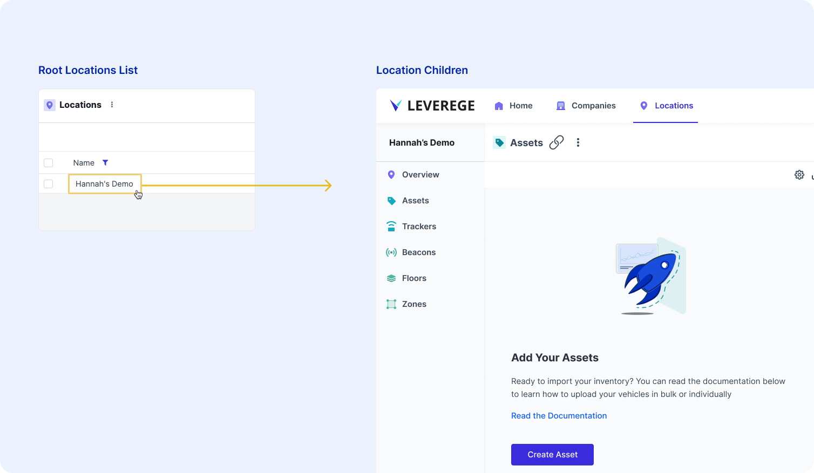
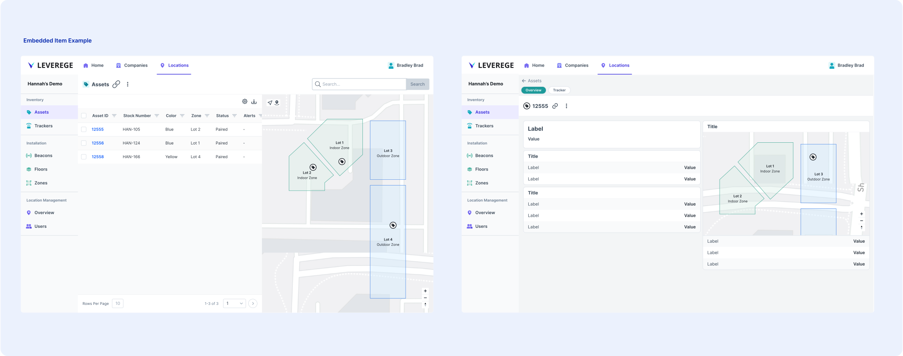

# Screen Display Options

## Nesting Screen Display

So far, we have used the automatic screen display option, which we call the nesting display. For the nesting display, when you select an item, you are drilled into an entirely new page about that item, featuring a sidebar of that item's children (example below).

<figure markdown>
{ width="700" }
  <figcaption>Nesting Screen Display</figcaption>
</figure>

## Embedded Screen Display

In many cases, you don't want the entire page to change when you click on an item. Instead, you want the details of a specific item to replace the item list. For example, if you are looking at a list of assets in your location and you select one to learn more, you might not want the side navigation to change to display that asset and it's children. 

<figure markdown>
{ width="700" }
  <figcaption>Embedded Screen Display</figcaption>
</figure>

In the image above, you can see the asset details screen replaced the list screen without changing the side navigation. On top of that, in the event that the asset is the parent in a relationship, you will see those child blueprint pages in the top section of the asset detail view. 

The tag to embed a screen is `itemScreen:embed`. This is a tag added to the relationship attribute of the blueprint you want to embed.

## No Screen Display

Sometimes, you don't want your user to drill into an item at all. The tag to hide the drill down page all together  is `itemScreen:none`. 

