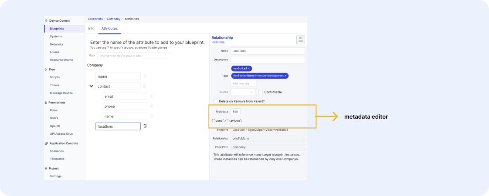

# Styling Overrides

To override any blueprint metadata at a specific relationship path, add the property to the metadata of the relationship attribute. For example, to override the location `navicon` at the company level, you’ll go to the company blueprint’s location attribute and add the metadata.

 <figure markdown>
 { width="700" }
   <figcaption>Override metadata at the relationship attribute</figcaption>
 </figure>

You can override anything from icons & strings to illustrations and documentation links. Anything you have been able to configure thus far can be changed.
