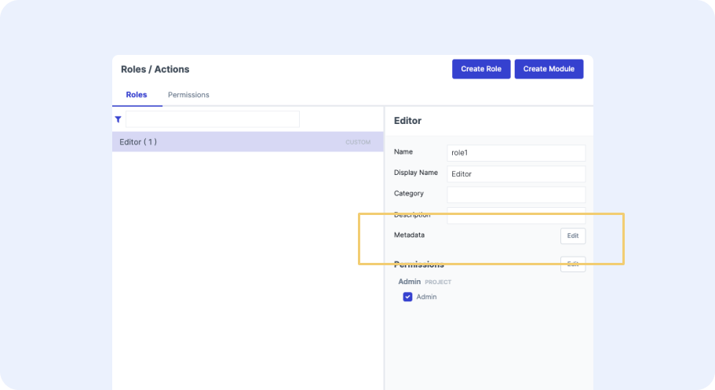

# Role-Specific Setup

If you want a role to have a specific home page in the UI, you can add metadata to the role to specify it's home page. To add the metadata, head to the roles tab in Architect and select the role. In the right panel, you will see an edit button next to the metadata section. 

<figure markdown>
{ width="700" }
  <figcaption>Editing Metadata in Architect</figcaption>
</figure>

## Properties

| JSON Path | Definition |
|-------|---------|
| `ui/defaultUrl` | Stores metadata for an initial url calculator for this role. |
| `ui/excludeFrom` | Used to filter roles from being presented in the UI. This includes the role picker in the user menu (top right of UI) and all model editors where a role can be selected for saving/loading models.|
| `ui/blockFrom` | Used to prevent users with certain roles from logging into named or default UIs |
| `priority` | Used by the UI to determine which role should take precedence when a user is assigned to multiple roles. |
| `usedAtBlueprints` | Used to filter roles presented in the User Access screen for a given object type. |


```json
{
  "ui": {
    "defaultUrl": {
      "type": "urlPathRoleCalculator",
      "single": "/p/roleName/blueprintAlias/:resourceId",
      "multiple": "/p/roleName/blueprintAlias",
      "resourceType": "blueprintUUID"
    },
    "blockFrom": [
      "uiName"
    ],
    "excludeFrom": [
      "uiName"
    ]
  },
  "priority": 1,
  "usedAtBlueprints": [
    "blueprintAlias"
  ]
}
```

