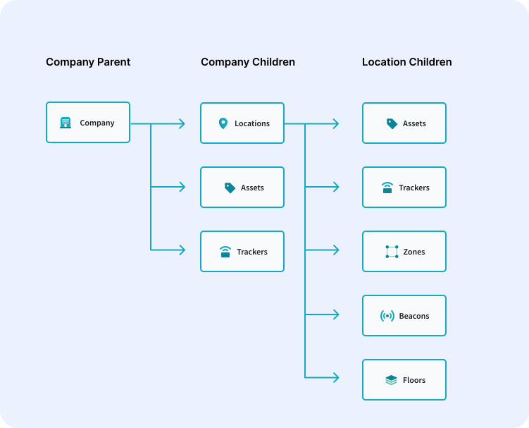
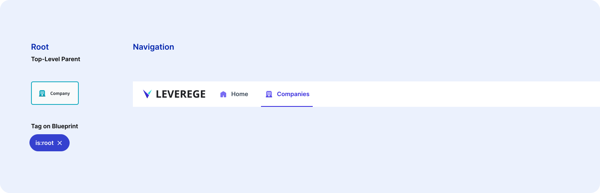
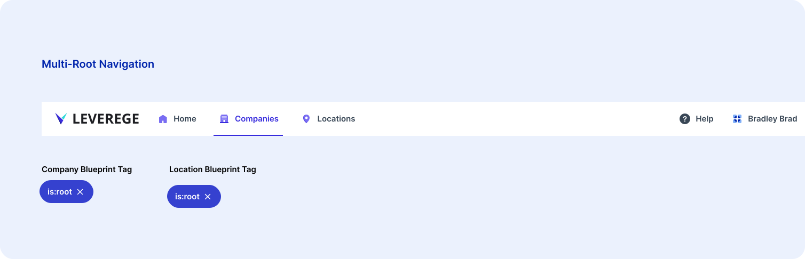
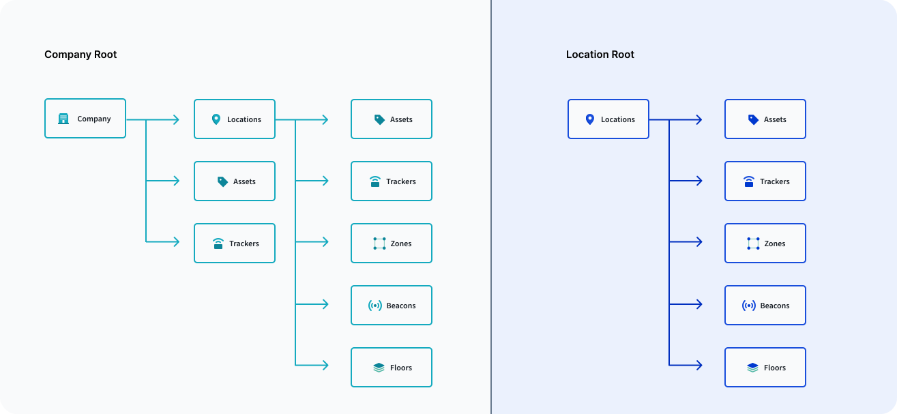
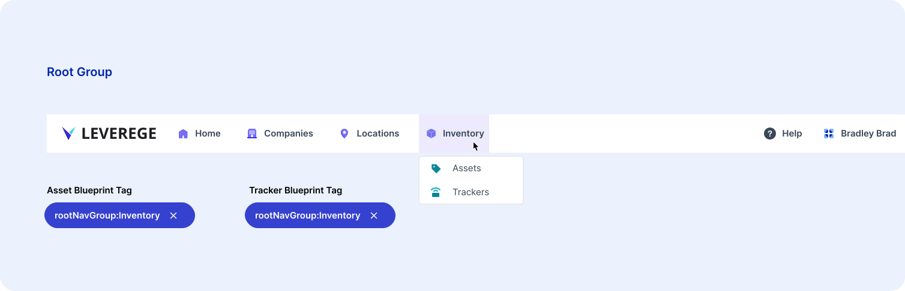
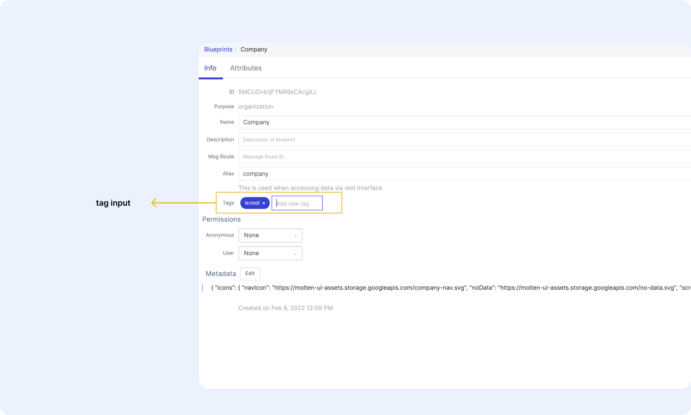

# Roots

In your UI, you have the ability to decide which blueprint or blueprints will be your root(s). By making a blueprint a root, you are selecting that blueprint to be the root of your hierarchy for that section of the UI. The root page will load a system-wide list of every item of that blueprint type. Let's take the hierarchy below as our example. 

<figure markdown>
{ width="700" }
  <figcaption>Hierarchy diagram</figcaption>
</figure>

Let's break down the relationships in the example above. The company blueprint has 3 child relationships, all of which are one-to-many. The child blueprints are:

- Location Blueprint
- Asset Blueprint
- Tracker Blueprint

The location blueprint also has child relationships, all of which are one-to-many. These child blueprints are: 

- Asset Blueprint
- Tracker Blueprint
- Zone Blueprint
- Beacon Blueprint
- Floor Blueprint

For a refresher on relationship types and usages, please review our [Blueprints & Relationships section](../../../architecture/blueprint/) help guide.

## Selecting Roots
You can have one root or multiple roots in your UI. In this case, it makes sense for the company blueprint to be a root, which will make the company blueprint a top level navigation option.

<figure markdown>
{ width="700" }
  <figcaption>Company root example</figcaption>
</figure>

On top of adding companies to the top level navigation, the root also will only load that blueprint and it's children. For example, if you selected the location blueprint as a root along with the company blueprint, you would see both in the top nav (example below). 

<figure markdown>
{ width="700" }
  <figcaption>Multi-root example</figcaption>
</figure>

Under the location's tab, you will have entirely new set of pages, representing the child blueprints, in your UI. This pages will be completely separate from the pages representing the same blueprint under the company root. To help visualize this, take a look at the diagram below. 

<figure markdown>
{ width="700" }
  <figcaption>Multi-root hierarchy</figcaption>
</figure>

## Root Groups

In some cases, it's helpful to see your assets or trackers across all companies or locations at the root level. In these types of cases, we find it helpful to group those pages together. The grouping mechanism puts a group of root pages into a dropdown in the top navigation, saving you critical screen space. 

<figure markdown>
{ width="700" }
  <figcaption>Group dropdown example</figcaption>
</figure>

These pages will load individually, so you will have one page for a system-wide list of assets and one for a system-wide list of trackers. 

## Configuring Roots

To make a blueprint a root, all you have to do is add the tag `is:root` to the blueprint tag section. 

<figure markdown>
{ width="700" }
  <figcaption>Group dropdown example</figcaption>
</figure>

Below are the different types of configuration options for roots via tags.

| Property | Purpose |
|-------|--------------|
| `is:root` | Adds the blueprint to the top-level navigation as a root |
| `rootNavGroup:<Name>` | If a blueprint is set as a root, it can be added to a group in the top navigation. Name represents which group the blueprint is added to and is used in the label of the dropdown  |
| `rootNavGroupIcons:<URL>` | To set the icon for a group, use this tag on any blueprint in that group. This icon must be hosted publicly online |

## Hiding Roots from Specific Roles

Not every role should have the same access, and the same goes for roots. You can easily hide a root from a given role by using the tag `excludeFrom:<Role>`

| Property | Purpose |
|-------|--------------|
| `excludeFrom:<Role>` | Hides this root from a given role |
| `excludeFrom:*` | Hides this root from all roles. Useful when more than one UI is used for a given project and a root is only needed for one of the two UIs. Note that this requires mutations to implement.  |

