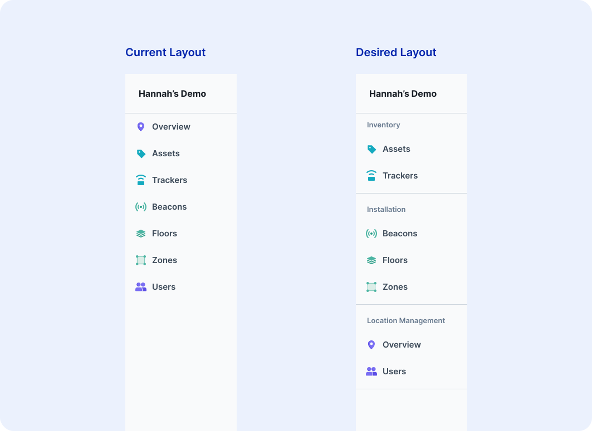

# Sort & Order Pages

Once you have selected and set up your root, you will find that by clicking on a root item, you are taken to a new page in the UI with a sidebar navigation. For example, let’s look at our example with locations. 

<figure markdown>
{ width="700" }
  <figcaption>Location example</figcaption>
</figure>

The sidebar navigation includes:

- An overview page of the item, named Overview
- All blueprints that have the location blueprint as a parent, regardless of if the relationship is one-to-one or one-to-many
- If user management is enabled, a users page. For more information on enabling user management, review {==our documentation here. ==}

!!! Tip “Icons”
    Reminder that the icons loading into the side navigation were set in the blueprint metadata. Revisit our icons documentation to review this process.

## Sections & Ordering

<figure markdown>
{ width="700" }
  <figcaption>Desired Layout</figcaption>
</figure>

We are going to break down how you get from the left sidebar navigation above to the right sidebar. To start, let’s break out and order our sections.

The tag to order your blueprints is `navSort:<SORT_KEY>`, where the sort key is comprised of a letter that determines the section and a number that determines the order. The letter and number are separated by a period. Each blueprint's tag is outlined below. 

- Assets: `navSort:a.1`
- Trackers: `navSort:a.2`
- Beacons: `navSort:b.1`
- Floors: `navSort:b.2`
- Zones: `navSort:b.3`

Because you are sorting the children relationships of a location, these tags get added to the relationship attribute of each blueprint on the location blueprint (image below). Once the tags are applied, you will see a divider align appear between section a & b.

<figure markdown>
{ width="700" }
  <figcaption>Relationship attribute editor</figcaption>
</figure>

The overview and users pages are ordered with different tags. These tags are added to the location blueprint itself. 

| Tag | Purpose |
|-------|-------------|
| `navSortOverview:<SORT_KEY>` | To order the overview page, add this tag to the parent blueprint |
| `navSortUserManagement:<SORT_KEY>` | To order the users page, add this tag to the parent blueprint |

For our example we're working on, the overview and users tags would follow the example below.

- Overview: `navSortOverview:c.1`
- Users: `navSortUserManagement:c.2`

Now that we've added all of our tags, our sidebar should look like the sidebar on the left in the image below. We'll be reviewing how to add section titles next.

<figure markdown>
{ width="700" }
  <figcaption>Sections & Ordering Outcome/figcaption>
</figure>


## Section Names

To add a section name, you'll want to identify the first page in each section. For our inventory section, the first page is the assets attribute. This is where you will add the tag `navSectionName:<NAME>`. 

If you want to add the section name above the user management or overview pages, you will need to add a string to your metadata on the parent blueprint. In this case, we would add the string to the metadata on the location blueprint.

| String |  Purpose |
|-------|-------------|
| `overviewSectionName` | If the overview page is the first page in a section, add this string to the parent blueprint metadata with the desired name.  |
| `userManagementSectionName` | If the users page is the first page in a section, add this string to the parent blueprint metadata with the desired name.  |

For our example, we added the two tags below. 

- On the assets attribute at the location blueprint: `navSectionName:Inventory`
- On the beacons attribute at the location blueprint: `navSectionName:Installation`

To add the location management section name, we added the following metadata to the location blueprint.

```json
{
 "strings": {
        "overviewSectionName": "Location Management"
}
```

## Hiding Pages from Roles

Not every role permissioned to a location should have access to every page. To quickly and easily hide a page from a role, use the `excludeFrom:<Role>` tag on the relationship attribute if the page is a blueprint. 

The user management page will only appear if the user has permission to perform user management actions. The overview page will appear for any user permissioned to that blueprint.
